# 📖 Documentación Maestra: API Gateway (Proyecto Omega)

> **Nota Autogenerada:** Este documento consolidado contiene todas las propuestas de arquitectura, decisiones GitOps (Opción G), análisis empresariales y resultados de diseño técnico listos para ser presentados o importados a Confluence.

---

# Análisis de Opciones: bw_omega-gateway — Proxy/Gateway para Migración a Microservicios

## 1. Contexto del Problema

### 1.1 ¿Qué es Omega?

**Omega** es una plataforma de **juegos online (betting)** que actualmente opera como un monolito. Sus servicios son consumidos por múltiples proveedores externos a través de una **URL única**. Se planifica una migración progresiva hacia una arquitectura de **microservicios**, lo cual implicaría que cada servicio tenga su propia URL.

### 1.2 Consideraciones de Tráfico

> ⚠️ **ADVERTENCIA:**
> Omega recibe **alto volumen de tráfico** en condiciones normales, y este caudal **se multiplica significativamente** durante eventos deportivos de alto perfil (Mundial de Fútbol, Finales de Champions, Super Bowl, etc.). El gateway debe estar diseñado para soportar estos picos sin degradar la experiencia.

Implicaciones para el diseño del gateway:
- **Latencia mínima:** Cada milisegundo cuenta en una plataforma de betting en tiempo real.
- **Autoescalado predecible:** Capacidad de escalar horizontalmente antes de los eventos.
- **Alta disponibilidad:** El gateway será un punto único de fallo si no se diseña correctamente.
- **Zero downtime deployments:** No se puede interrumpir el servicio para desplegar nuevas reglas de ruteo.

### 1.3 El Problema

**Problema:** Los proveedores no deben verse forzados a cambiar sus integraciones ni rutear hacia múltiples URLs nuevas.

**Solución:** Interponer un componente de tipo **Proxy/Gateway** que:
1. **Fase 1 (Pasamanos):** Reciba todo el tráfico en la URL original y lo reenvíe de forma **100% transparente** a Omega (sin cambios para nadie). El gateway debe actuar como un espejo: la única diferencia es la URL del servicio destino. Todo lo demás (headers, body, query params, cookies, método HTTP) debe pasar intacto.
2. **Fase 2 (Ruteo inteligente):** Progresivamente, identifique las peticiones por `branchId` y las dirija al microservicio correspondiente o a Omega si ese servicio aún no fue migrado.


### 1.4 Clarificación Conceptual: ¿API Gateway o Reverse Proxy?

A nivel de arquitectura de diseño empresarial, es fundamental delinear qué patrón estamos implementando con "bw_omega-gateway":

*   **¿Qué NO estamos construyendo? (Reverse Proxy Puro):** Un *Reverse Proxy* clásico (como NGINX o Envoy Server crudo) es una capa agnóstica de transporte. Recibe una conexión HTTP y ciegamente balancea o rutea hacia backends basándose solamente en la URL o el puerto (e.g., `/api/*` va al Servidor 2). **No conoce reglas de negocio ni lee el estado de la sesión de los usuarios.**
*   **¿Qué SÍ estamos construyendo? (Un API Gateway Institucional):** El sistema diseñado es el orquestador inteligente (*Smart Endpoint*) del dominio de Betting. Se denomina **API Gateway** porque asume responsabilidades transaccionales, de seguridad y telemetría complejas:
    1.  **Transformación y Resolución Transaccional:** Captura *Cookies de Sesión* pasivas, cruza información en tiempo real con una Base **In-Memory Redis** (ElastiCache) para inferir el proveedor (`branchId`), inyectando proactivamente el Header antes de enviarlo al microservicio interno.
    2.  **Lógica Condicional (Business Routing):** La derivación `/api/pagos` hacia `MS_PAGOS` no rige puramente sobre el path HTTP, sino que obliga a una condicionalidad estricta (ej. `branchId === 200`). De fallar, implementa *Fallback Routing* orgánico hacia Omega.
    3.  **Cross-Cutting Concerns:** Integra Datadog APM nativo inyectando *Spans/Traces* a cada request y orquesta el modelado de observabilidad general.

### 1.5 Lógica de Ruteo por `branchId`

El ruteo se basa en el parámetro `branchId`, que identifica la sucursal/operación del proveedor:

```
Caso 1: branchId presente en el Header HTTP
┌─────────────────────────────────────────────────┐
│ Request llega con Header: branchId=100          │
│ → Gateway lee el header directamente            │
│ → Resuelve destino según tabla de ruteo         │
│ → Forwadea al servicio correspondiente          │
└─────────────────────────────────────────────────┘

Caso 2: branchId AUSENTE en el Header
┌─────────────────────────────────────────────────┐
│ Request llega SIN header branchId               │
│ → Gateway inspecciona datos de sesión           │
│ → Deriva el branchId a partir de la sesión (*)  │
│ → Resuelve destino según tabla de ruteo         │
│ → Forwadea al servicio correspondiente          │
└─────────────────────────────────────────────────┘
(*) La lógica para derivar branchId desde la sesión aún no está definida.
```

### 1.5 URLs de Ruteo (Ejemplo)

Las URLs de destino aún no están definidas. A continuación se incluyen 10 URLs de ejemplo que representan el esquema esperado:

| # | branchId (ejemplo) | Servicio Destino | URL de Ejemplo |
|---|---|---|---|
| 1 | 100 | Omega (Monolito) | `http://omega-monolith.internal:8080` |
| 2 | 200 | ms-pagos | `http://ms-pagos.internal:8080` |
| 3 | 300 | ms-usuarios | `http://ms-usuarios.internal:8080` |
| 4 | 400 | ms-apuestas | `http://ms-apuestas.internal:8080` |
| 5 | 500 | ms-eventos | `http://ms-eventos.internal:8080` |
| 6 | 600 | ms-reportes | `http://ms-reportes.internal:8080` |
| 7 | 700 | ms-notificaciones | `http://ms-notificaciones.internal:8080` |
| 8 | 800 | ms-liquidaciones | `http://ms-liquidaciones.internal:8080` |
| 9 | 900 | ms-riesgo | `http://ms-riesgo.internal:8080` |
| 10 | 1000 | ms-backoffice | `http://ms-backoffice.internal:8080` |

> ℹ️ **NOTA:**
> En la Fase 1, **todos los branchId** se rutean a Omega (monolito). La tabla se activa progresivamente en Fase 2/3.

### 1.6 Principio Fundamental: Pasamanos Transparente

> ❗ **IMPORTANTE:**
> El gateway **NO debe modificar la invocación** en ningún aspecto excepto la URL de destino. Todo el contenido del request original (método HTTP, headers, body, query params, cookies, content-type) debe llegar **intacto** a Omega o al microservicio destino. El gateway es un espejo con ruteo.

### 1.7 Requisitos de Observabilidad

La aplicación **debe contar con Datadog** para monitoreo:
- APM (Application Performance Monitoring) para trazas de cada request.
- Métricas de latencia, throughput y errores del gateway.
- Correlación con AWS CloudWatch (solución ya implementada).
- Dashboards de tráfico por `branchId` y por proveedor.
- Alertas durante picos de eventos deportivos.

### 1.8 Restricciones Técnicas

- Despliegue en **AWS** (Fargate como opción principal).
- Infraestructura gestionada con **Terraform**.
- Compatibilidad con el ecosistema existente (Datadog, CloudWatch, ALB).
- Capacidad de soportar picos de tráfico durante eventos deportivos.

### 1.9 Estrategia de Mitigación y Despliegue en Producción

Dado que hoy Omega recibe todas las invocaciones directo, la interposición de este Gateway está diseñada para mitigar totalmente cualquier riesgo de interrupción de servicio hacia los Proveedores Externos:

1. **Pasamanos Transparente (Reverse Proxy Puro):** En la Fase 1 de despliegue, el Gateway opera en modo "Shadow". Cualquier request que recibe (incluyendo Cabeceras, Body, Parámetros y Cookies) es replicada y forwadeada de manera idéntica hacia Omega. Para el monolito actual, el tráfico lucirá exactamente igual a interactuar con los proveedores de entrada.
2. **Corte y Transición por DNS (Route53):** Para el Go-Live, no es necesario orquestar ventanas de mantenimiento con los Proveedores de Betting. La puesta en producción se realizará de manera invisible mediante un **DNS Cutover** en AWS. Se actualizará la resolución del dominio base (e.g. `api.omega.com`) para que deje de apuntar al ALB actual de Omega, y comience a apuntar al nuevo ALB del Gateway.
3. **Rollback de Emergencia Inmediato (< 3 segundos):** Si tras desviar el tráfico hacia el Gateway se detectan anomalías graves, degradación de latencia o fallos volumétricos imprevistos, el plan de contingencia es *Trivial y Seguro*: Se revierte el registro DNS en AWS para enrutar el tráfico nuevamente de forma directa a Omega, extrayendo el Gateway del medio en cuestión de segundos.

---

## 2. Opciones Evaluadas

### Opción A: AWS ALB + Listener Rules (Solo Infra, sin código)

| Aspecto | Detalle |
|---|---|
| **Descripción** | Usar el Application Load Balancer de AWS con reglas de enrutamiento nativas basadas en path, headers o query strings. No requiere escribir código de aplicación. |
| **Fase 1 (Pasamanos)** | Una regla default que manda todo al Target Group del monolito. Trivial. |
| **Fase 2 (Ruteo)** | Se agregan Listener Rules en Terraform que matchean por path (`/api/v2/pagos/*` → microservicio Pagos) o por header/query (`branchId`). |
| **Ventajas** | ✅ Cero código de aplicación. ✅ Escalado y alta disponibilidad nativa. ✅ Costo mínimo (sin contenedores extra). ✅ Latencia mínima (capa de red pura). |
| **Desventajas** | ❌ Ruteo limitado a path, header, query string y host. No puede leer el body ni datos de sesión. ❌ Máximo ~100 reglas por listener. ❌ Lógica de decisión binaria (no soporta lógica condicional compleja como "si branchId=X Y el usuario tiene rol Y"). |
| **Cuándo elegirla** | Si el routeo puede resolverse **exclusivamente** por path o headers HTTP simples sin leer el cuerpo ni la sesión. |

---

### Opción B: Spring Cloud Gateway (Aplicación Java en Fargate)

| Aspecto | Detalle |
|---|---|
| **Descripción** | Proyecto Java basado en **Spring Cloud Gateway** (reactivo, Netty) desplegado como contenedor en ECS Fargate. Framework nativo del ecosistema Spring para construir API Gateways con filtros y predicados programáticos. |
| **Fase 1 (Pasamanos)** | Una ruta `default` con un `uri: lb://monolito` que proxea todo. Se configura en YAML o en código. |
| **Fase 2 (Ruteo)** | Predicados custom en Java que leen `branchId` desde query params, headers o cookies de sesión y deciden el destino. Filtros para transformar headers, agregar autenticación, etc. |
| **Ventajas** | ✅ Ecosistema Spring nativo (mismo stack que el monolito existente). ✅ Filtros y predicados programáticos: permite lógica compleja (leer sesión, consultar DB/cache, etc). ✅ Integración directa con Datadog Java Agent (misma solución de trazabilidad que ya tenemos). ✅ Service Discovery con Spring Cloud si se necesita. ✅ Circuit breaker integrado (Resilience4j). |
| **Desventajas** | ❌ Es una aplicación Java completa: requiere mantenimiento, updates de dependencias, JVM. ❌ Cold start de la JVM (~5-15s, mitigable con warm pools). ❌ Consumo de memoria base de la JVM (~256-512MB mínimo). |
| **Cuándo elegirla** | Si el equipo ya trabaja con Spring Boot y necesita lógica de ruteo compleja que dependa de datos de sesión o lógica de negocio. |

**Ejemplo de ruta en YAML:**
```yaml
spring:
  cloud:
    gateway:
      routes:
        # Fase 1: Todo al monolito
        - id: default-monolith
          uri: http://monolito-alb.internal:8080
          predicates:
            - Path=/**
          order: 9999

        # Fase 2: Ejemplo de ruteo por branchId
        - id: payments-service
          uri: http://pagos-service.internal:8080
          predicates:
            - Path=/api/pagos/**
            - Query=branchId, 100|200|300
          order: 1
```

---

### Opción C: NGINX / OpenResty como Reverse Proxy (Contenedor en Fargate)

| Aspecto | Detalle |
|---|---|
| **Descripción** | Un contenedor NGINX (o OpenResty para scripting Lua) configurado como reverse proxy. Ruteo basado en `location` blocks y variables de request. |
| **Fase 1 (Pasamanos)** | Un bloque `location / { proxy_pass http://monolito; }`. Extremadamente sencillo. |
| **Fase 2 (Ruteo)** | Se agregan `location` blocks con matching por path. Para lógica compleja (leer branchId del query string), se puede usar `map` de NGINX o scripts Lua con OpenResty. |
| **Ventajas** | ✅ Rendimiento excepcional (bajo consumo CPU/RAM). ✅ Imagen Docker ultra liviana (~20MB). ✅ Cold start prácticamente instantáneo. ✅ Ideal como pasamanos puro. |
| **Desventajas** | ❌ Lógica compleja requiere Lua (OpenResty), lenguaje menos familiar para equipos Java. ❌ Difícil leer datos de sesión (cookies firmadas, tokens JWT) sin plugins adicionales. ❌ No tiene integración nativa con Datadog Java Agent (necesita Datadog NGINX module aparte). ❌ Debugging y testing más artesanal. |
| **Cuándo elegirla** | Si la prioridad es rendimiento extremo y el ruteo se resuelve solo por path/headers sin lógica de negocio. |

---

### Opción D: AWS API Gateway (Servicio Gestionado)

| Aspecto | Detalle |
|---|---|
| **Descripción** | Usar AWS API Gateway (HTTP API o REST API) como punto de entrada gestionado, con integraciones hacia los targets (monolito o microservicios). |
| **Fase 1 (Pasamanos)** | Una integración HTTP proxy que forwardea todo al monolito. |
| **Fase 2 (Ruteo)** | Se definen rutas por path/method que apuntan a distintas integraciones (VPC Links hacia los microservicios en Fargate). |
| **Ventajas** | ✅ Cero infraestructura propia que mantener. ✅ Throttling, API Keys, y authorizers nativos. ✅ Escalado automático ilimitado. ✅ Integración nativa con CloudWatch y IAM. |
| **Desventajas** | ❌ Costo por request (puede ser significativo con alto tráfico de proveedores). ❌ Latencia adicional (~10-30ms por hop). ❌ Lógica de ruteo limitada (no lee body, sesión, ni hace lógica condicional compleja). ❌ Posibles límites de payload (10MB). ❌ Vendor lock-in más fuerte. |
| **Cuándo elegirla** | Si el volumen de requests es bajo/medio y se quiere delegar completamente la operación del gateway a AWS. |

---

### Opción E: AWS CloudFront + Lambda@Edge

| Aspecto | Detalle |
|---|---|
| **Descripción** | CloudFront como CDN/proxy con funciones Lambda@Edge que inspeccionan la request y deciden el origin (monolito o microservicio). |
| **Fase 1 (Pasamanos)** | Default origin apuntando al monolito. |
| **Fase 2 (Ruteo)** | Lambda@Edge en el evento `origin-request` que lee `branchId` y cambia el origin dinámicamente. |
| **Ventajas** | ✅ CDN + Proxy en uno. ✅ Distribución global. ✅ Caching integrado. |
| **Desventajas** | ❌ Lambda@Edge tiene limitaciones fuertes (5s timeout, 1MB response, solo Node.js/Python). ❌ Deploy lento (~15-20min por cambio). ❌ Debugging extremadamente difícil. ❌ No puede acceder a recursos de VPC directamente. ❌ Overengineering para este caso de uso. |
| **Cuándo elegirla** | Solo si necesitás caching global agresivo y distribución geográfica. No recomendada para este caso. |

---

## 3. Matriz Comparativa

| Criterio | A: ALB Rules | B: Spring Cloud GW | C: NGINX | D: API GW | E: CloudFront |
|---|---|---|---|---|---|
| **Complejidad Fase 1** | ⭐ Trivial | ⭐⭐ Baja | ⭐ Trivial | ⭐⭐ Baja | ⭐⭐⭐ Media |
| **Lógica Ruteo Compleja** | ❌ Limitada | ✅ Total | ⚠️ Con Lua | ❌ Limitada | ⚠️ Limitada |
| **Lectura de Sesión** | ❌ No | ✅ Sí | ⚠️ Difícil | ❌ No | ❌ No |
| **Ruteo por branchId** | ⚠️ Solo query/header | ✅ Query/Header/Body/Session | ⚠️ Query/Header | ⚠️ Solo path | ⚠️ Con Lambda |
| **Costo Operativo** | ⭐ Mínimo | ⭐⭐⭐ Medio | ⭐⭐ Bajo | ⭐⭐⭐ Variable | ⭐⭐ Bajo |
| **Latencia Adicional** | ⭐ Ninguna | ⭐⭐ Baja (~2-5ms) | ⭐ Mínima | ⭐⭐⭐ Media (~15ms) | ⭐⭐ Variable |
| **Stack Familiar** | ✅ Terraform puro | ✅ Java/Spring | ❌ NGINX/Lua | ⚠️ AWS Console/TF | ❌ Node.js |
| **Trazabilidad Datadog** | ⚠️ Solo ALB logs | ✅ Java Agent nativo | ⚠️ Módulo NGINX | ⚠️ CloudWatch | ❌ Difícil |
| **Mantenimiento** | ⭐ Nulo | ⭐⭐⭐ Medio | ⭐⭐ Bajo | ⭐ Nulo | ⭐⭐ Bajo |

### 3.1 Cumplimiento de Ruteo Estático (GitOps en Memoria - $0 / 0ms)

Se evaluó la capacidad de cada alternativa para satisfacer el patrón de configuración externalizada (evitando mapeos hardcodeados en el runtime y evitando llamadas de red extras a Redis por cada request HTTP):

| Propuesta | ¿Soporta Tabla de Ruteo Estática Externa? | Mecanismo de Implementación / Modificación | Cumplimiento | Limitante Técnico |
|---|---|---|---|---|
| **A: ALB Rules** | ✅ Sí | Se configura vía **Terraform IaC**. Las reglas se inyectan en AWS. | Pleno | Es ciego, no puede leer cookies de sesión ni consultar a Redis. |
| **B: Spring Boot** | ✅ Sí | Se configuró el archivo **`application.yml`** donde Spring lee las reglas. | Pleno | Ninguna. Soporta consultar a Redis si la cookie requiere traducción a branchId. |
| **C: NGINX** | ✅ Sí | Archivo de sistema **`nginx.conf`** con directiva `map`. | Pleno | Dificultad extrema para contactar a Redis en Sub-ms dentro de NGINX crudo. |
| **D: API Gateway** | ✅ Sí | Integración de AWS configurada vía **OpenAPI/Terraform**. | Pleno | No puede extraer `branchId` incrustado en payloads complejos sin mapping templates limitados. |
| **E: CloudFront** | ✅ Sí | Requiere embeber **`routes.json`** en el bundle de la Lambda@Edge. | Parcial | El despliegue a los CDN periféricos Edge tarda de 10 a 20 minutos por cambio de ruta. |
| **F: KrakenD** | ✅ Sí | Configuración declarativa mediante **`krakend.json`**. | Pleno | No cuenta con lógica condicional "IF" basada en branchId sin plugins Go injectados. |
| **G: Go (Elegida)** | ✅ Sí | Refactorizado para parsear **`routes.yaml`** a la memoria RAM. | Pleno | Absoluto ganador considerando velocidad P99 <1ms. |
| **H: Node.js** | ✅ Sí | Refactorizado para parsear **`routes.json`** vía `fs.readFileSync()`. | Pleno | Penalización menor en el GC del V8 Engine frente a Go. |

---

## 4. Recomendación Definitiva

> ❗ **IMPORTANTE:**
> **Opción G (Custom Go Reverse Proxy en Fargate)** es el candidato ganador definitivo, elegido por sobre la Opción B (Java Spring), complementado con **Opción A (ALB Rules)** como primera capa de Firewall.

### Justificación de la Elección de Go

1. **Rendimiento y Footprint inigualables:** Al compilarse estáticamente en una imagen `scratch/alpine` (15MB), la Opción G consume apenas **~20MB de RAM**, versus los ~400MB base que exige la JVM para arrancar Spring Webflux (Opción B). En un entorno *Serverless* como Fargate, donde se paga por CPU/RAM provisionada, esto significa una fracción del costo operativo.
2. **Cero Cold Starts (Resiliencia a Spikes):** Un evento deportivo de pico máximo puede requerir escalar contenedores rápido. Go levanta en **< 5 milisegundos**.
3. **Control de Lógica Compleja (El requisito central):** A diferencia de NGINX, Go nos permite programar en código `main.go` cualquier regla de negocio (como delegar autenticación, inyectar lógicas de ruteo por fallbacks vacíos, conectarnos a Redis Elasticache para Rate Limits, etc) tal cual lo haríamos en Java, pero de forma más asíncrona usando **Goroutines**.
4. **Trazabilidad Datadog y AWS WAF:** Go tiene una librería APM de Datadog oficial fantástica que insertamos fácilmente con `httptrace.WrapHandler`. Toda la capa de seguridad perimetral sigue delegada al WAF de AWS.
5. **La arquitectura definitiva propuesta:**
   - **AWS WAF** → Filtro DDoS y XSS perimetral.
   - **ALB** → recibe tráfico externo, SSL termination, health checks.
   - **Go Gateway (Fargate)** → recibe del ALB, decodifica el `branchId` u o los fallbacks a `Omega`.
   - **Omega / Microservicios (Fargate)** → destinos finales.

### Fases de Implementación
| Fase | Alcance | Configuración |
|---|---|---|
| **Fase 1** | Pasamanos total. Todo va a Omega (monolito). | Una ruta `/**` → Omega. El gateway es transparente y no modifica nada. |
| **Fase 2** | Ruteo por `branchId` (header) para servicios ya migrados. | Rutas por branchId (`branchId=200` → ms-pagos). Default sigue a Omega. |
| **Fase 3** | Resolución de `branchId` desde sesión + ruteo inteligente. | Filtro custom que detecta ausencia de branchId, consulta sesión, resuelve y rutea. |

---

## 5. Estrategia de Testing

Para validar el gateway sin depender de Omega ni de proveedores reales, se requieren **mocks**:

### 5.1 Mock de Omega (Backend)
Una aplicación simple que simule el comportamiento de Omega:
- Recibe requests en cualquier path/método.
- Valida que el request llega **intacto** (headers, body, query params, cookies).
- Responde con un JSON que incluye: el request recibido completo, timestamp, y un flag de éxito.
- Sirve para verificar que el gateway actúa como pasamanos transparente.

```json
// Response esperada del Mock Omega
{
  "mock": "omega",
  "received": {
    "method": "POST",
    "path": "/api/apuestas/crear",
    "headers": { "branchId": "100", "Content-Type": "application/json", "..." : "..." },
    "body": { "eventoId": 12345, "monto": 500 },
    "queryParams": { "divisa": "ARS" }
  },
  "timestamp": "2026-03-31T21:00:00Z",
  "integrity": "PASS"
}
```

### 5.2 Mock de Proveedores (Clientes)
Scripts o aplicaciones que simulen el comportamiento de los proveedores:
- Envían requests variados (GET, POST, PUT, DELETE) con distintos paths, bodies y headers.
- Algunos incluyen `branchId` en el header, otros no (para probar la resolución por sesión).
- Permiten ejecutar pruebas de carga para simular picos de eventos deportivos.
- Validan que la respuesta recibida es la esperada.

### 5.3 Escenarios de Testing

| # | Escenario | Resultado Esperado |
|---|---|---|
| 1 | Request con `branchId=100` en header | Rutea a Omega. Request llega intacto. |
| 2 | Request sin `branchId` en header | Resuelve branchId desde sesión, rutea correctamente. |
| 3 | Request POST con body JSON grande | Body llega intacto a Omega sin truncamiento. |
| 4 | Request con headers custom del proveedor | Todos los headers se preservan en Omega. |
| 5 | Request con query params complejos | Query params llegan intactos a Omega. |
| 6 | Request con cookies de sesión | Cookies se forwadean sin modificación. |
| 7 | Prueba de carga (simulación evento deportivo) | Gateway autoescala y mantiene latencia < 10ms. |
| 8 | Omega no disponible (timeout/error) | Gateway responde con error apropiado y loguea. |
| 9 | branchId desconocido | Fallback: rutea a Omega (monolito). |
| 10 | Request con múltiples content-types | Cada content-type se forwadea sin alteración. |

---

## 6. Decisiones

### Resueltas
- [x] **Nombre definitivo del proyecto:** `bw_omega-gateway`.
- [x] **¿Cómo viaja el `branchId`?** — Viaja como **header HTTP** en cada request. El gateway debe leer este header para tomar decisiones de ruteo.
- [x] **¿Qué pasa si no viene el `branchId`?** — El gateway debe inspeccionar los datos de sesión del request y derivar el `branchId` a partir de ellos. La lógica exacta de esta derivación aún no está definida.
- [x] **Observabilidad:** La aplicación debe contar con Datadog (APM + métricas + alertas) integrado.
- [x] **Principio de pasamanos:** El gateway NO modifica el request. Solo cambia la URL destino.

### Pendientes de Definición
- [ ] **Lógica de derivación de `branchId` desde sesión** — ¿Cómo se obtiene el branchId cuando no viene en el header? ¿De qué campo de la sesión? ¿Requiere consultar una DB o cache?
- [ ] **URLs reales de destino** — Se configuraron placeholders (`${MS_PAGOS_URL}`) pero falta llenarlos con los dominios internos de AWS.
- [ ] **¿Qué datos de sesión se necesitan para rutear?** — Token JWT, cookie de sesión, claims específicos. Se definirá cuando se implemente la Fase 3.
- [ ] **¿Cuántos proveedores/integraciones hay?** — Para dimensionar el Task de Fargate correctamente.
- [ ] **⚠️ ¿Omega tiene alguna validación de origen?** — ¿Omega valida desde dónde es invocada (IP whitelist, certificado mTLS, API key, header de origen)? Si es así, el gateway necesitará presentar las credenciales correctas para que Omega acepte los requests. **Esto es crítico y debe validarse antes de la implementación en Producción**.

### Resueltas Recientemente (Fase Productiva Opción B)
- [x] **Rate Limiting y Throttling:** Resuelto. Se implementó un algoritmo *Token Bucket* apoyado en un cluster nativo de **Amazon ElastiCache (Redis)**. Identifica a cada proveedor por su IP emisora (`remoteAddressKeyResolver`) para prevenir abusos.
- [x] **Seguridad Perimetral y Autenticación:** Se delega la capa de autorización bruta al **AWS WAF** (Core Rule Set para frenar inyecciones). El Gateway actúa puramente como ruteador y delegará los chequeos de negocio o tokens finos al microservicio subyacente o a Omega.


---

# ADR (Architecture Decision Records) — bw_omega-gateway

## Registro de Decisiones de Arquitectura

Este documento registra las decisiones técnicas y arquitectónicas tomadas durante el desarrollo del proyecto `bw_omega-gateway`. Cada decisión incluye el contexto, las opciones evaluadas, la decisión final y sus consecuencias.

---

## ADR-001: Tecnología del Gateway

- **Estado:** Aceptado
- **Fecha:** 2026-03-31 (Actualizado 2026-04-01)
- **Contexto:** Se necesita un componente proxy/gateway que permita la migración transparente del monolito a microservicios sin impactar a proveedores externos.
- **Opciones evaluadas:** ALB Rules, Spring Cloud Gateway, NGINX/OpenResty, Node.js, AWS API Gateway, Custom Go API Gateway (ver [propuesta_gateway.md](01_propuesta_gateway.md)).
- **Decisión final re-evaluada:** **Custom Go API Gateway (Opción G)** interactuando con **Redis In-Memory** tras validación empírica en Spike testing K6.
- **Consecuencias:**
  - El Gateway demostró latencia de ruteo P99 por debajo de 1ms consumiendo <20MB de RAM.
  - Se reutiliza la trazabilidad Datadog ya implementada nativamente mediante `dd-trace-go`.
  - Despliegues ultra-rápidos en Fargate gracias a binarios estáticos sin recargo de capas JVM.

---

## ADR-002: Estrategia de Despliegue

- **Estado:** Aceptado
- **Fecha:** 2026-03-31
- **Contexto:** El gateway debe ejecutarse en AWS con alta disponibilidad.
- **Decisión:** AWS ECS Fargate con Terraform como IaC y Github Actions.
- **Consecuencias:**
  - Sin gestión de instancias EC2, permitiendo Zero-Downtime deployments (testeados via k6).
  - Patrón Sidecar para Datadog Agent (consistente con la solución de trazabilidad existente).

---

## ADR-003: Estrategia de Migración (Strangler Fig Pattern)

- **Estado:** Aceptado
- **Fecha:** 2026-03-31
- **Contexto:** La migración del monolito a microservicios será progresiva. Se necesita una estrategia que no requiera un "big bang".
- **Decisión:** Implementar el patrón **Strangler Fig**:
  1. El gateway arranca ruteando todo al monolito (Fase 1: Pasamanos).
  2. A medida que se extraen microservicios, se agregan rutas específicas usando el Header `branchId`.
  3. Cuando todo esté migrado, se retira el monolito de Omega.

---

## ADR-004: Aseguramiento de Calidad Continua (Testing)

- **Estado:** Aceptado
- **Fecha:** 2026-04-01
- **Contexto:** Prevenir degradación de performance y seguridad con código nuevo introducido en el Gateway.
- **Decisión:** 
  - Jenkins/GH Actions ejecutarán Trivy image scanning sobre cada build.
  - Pruebas Funcionales en bash (CI Smoke Testing).
  - Grafana k6 inyectará assert thresholds (rate de éxito de enrutamiento 100%, P99 Latency < 200ms) pre-producción.
- **Consecuencias:**
  - Despliegues pueden bloquearse si K6 excede thresholds de latencia.
  - Mayor madurez del SDLC del proyecto.

---

## ADR-005: Almacenamiento Dinámico vs Estático de Reglas de Ruteo (Mapping)

- **Estado:** Aceptado
- **Fecha:** 2026-04-01
- **Contexto:** Se deben almacenar las reglas direccionales de cada proveedor (`branchId 200 -> URL_MS_PAGOS`) sin hardcodearlas en el binario de Go.
- **Opciones evaluadas evaluando Latencia y Costo:**
  1. **GitOps File (`routes.yaml` en RAM):** Las rutas se parsean desde un YAML en tiempo de arranque con reloads via Pipeline. Latencia=0ms, Costo=$0.
  2. **Variables de Entorno Estáticas (`ENV ROUTES`):** Latencia=0ms, Costo=$0. Dificultad severa para mapeo complejo anidado.
  3. **Mapeo Dinámico constante en Redis:** Consultar la base Redis por *cada* request entrante buscando a qué URL derivar. Latencia=+0.5ms adicionales permanentes de red, Costo=Incremento del recargo de IO y Fargate Data Transfer-IN/OUT en alto volumen.
- **Decisión:** **Opción 1 (GitOps File via `routes.yaml`)**. 
- **Consecuencias:**
  - **Latencia Optimizada (0ms):** El enrutamiento es una operación O(n) instantánea ejecutada 100% en memoria en la Goroutine actual sin requerir Network Hops extras a sub-sistemas de AWS.
  - **Costo nulo:** Fargate no factura extra por el simple uso de la RAM reservada, pero sí habría costo computacional o de red extra si abusáramos de Redis para configuraciones estáticas.
  - **Seguridad y Auditoría:** Los Microservicios futuros se habilitarán modificando `routes.yaml` via un Pull Request aprobado y trazable, previniendo caídas totales de ruteo por purgas accidentales en Redis.

---

## ADR-006: Exclusión de Arquitectura Hexagonal (Ports & Adapters)

- **Estado:** Aceptado
- **Fecha:** 2026-04-01
- **Contexto:** Se planteó aplicar los principios de la Arquitectura Hexagonal (habitual en los microservicios corporativos creados con Go) directamente en el proyecto del `bw_omega-gateway` (Opción G).
- **Decisión:** **Se excluye rotundamente el uso de Arquitectura Hexagonal** prefiriendo un Diseño Plano (Event-Loop directo) en `main.go`.
- **Consecuencias:**
  - **Over-engineering:** Un API Gateway **no** es un conjunto de reglas de negocio intrínsecas (ej. no procesa tarjetas de crédito, no tiene dominio *Usuario*, etc). Es un adaptador de infraestructura viva de red (HTTP a HTTP).
  - **Latencia y Memory Footprint:** Abstraer el `httputil.ReverseProxy` en docenas de carpetas con Puertos y Adaptadores solo genera milisegundos de overhead al encadenar interfaces abstractas sin sumar ningún beneficio estructural real de aislamiento (ya que todo en este punto es Infra).
  - **Facilidad de Auditoría:** El diseño lineal permite a un Site Reliability Engineer (SRE) leer y parchear configuraciones de Headers sin tener que indagar el ecosistema de *UseCases*.
  - **Alineación:** La arquitectura Hexagonal quedará restringida estrictamente para los **Back-Ends y Microservicios internos** transaccionales (como `ms-pagos` / `ms-apuestas`), donde el desacople del modelo de Base de Datos es mandatario.

---

## Plantilla para Nuevas Decisiones

```markdown
## ADR-XXX: [Título]

- **Estado:** Propuesto | Aceptado | Deprecado | Reemplazado
- **Fecha:** YYYY-MM-DD
- **Contexto:** [Por qué se necesita esta decisión]
- **Opciones evaluadas:** [Lista de alternativas consideradas]
- **Decisión:** [Qué se decidió y por qué]
- **Consecuencias:** [Impacto positivo y negativo de la decisión]
```


---

# Análisis Analítico de Costos vs Arquitecturas (AWS)

Para elegir el API Gateway correcto, la técnica y la performance deben cruzarse con los costos reales de Infraestructura en Nube. 
En una plataforma de apuestas (*Betting*), el tráfico se caracteriza por ser masivo (decenas de millones de requests en tiempo real por el *Polling* constante de *Odds*/Cuotas) y extremadamente picudo (ej: cuando hay un penalti o un gol).

El siguiente es un estimado de despliegue en la región AWS `us-east-1` (Alta Disponibilidad en 3 zonas, bajo una simulación de **100 Millones de Requests al mes**).

---

## 0. Prerrequisitos de Capacity Planning (Pregunta Abierta)

Antes de definir la cantidad final de réplicas base de contenedores o la agresividad de las reglas de **Autoescalado** en AWS (Target Tracking Scaling Policy) y los tamañon de In-Memory DBs, debemos contestar al problema de **Escalabilidad** midiendo la línea de tráfico orgánico y picos. 

> ❗ **IMPORTANTE:**
> **Definición de Tráfico Pendiente (Acción Requerida del Equipo Core):**
> ¿Cuántas invocaciones de los proveedores integrados y usuarios estamos estimando procesar habitualmente y durante eventos top? Necesitamos rellenar o mapear esta proyección volumétrica para dimensionar la subred VPC:

*   **RPS (Requests Per Second) Esperados:** ¿Tráfico Valle? ¿Tráfico Pico (ej. partido Boca-River o Final del Mundo)? (Ej: *200 / 5,000 RPS*).
*   **RPM (Requests Per Minute):** Crucial para setear las directivas del Troughput y Alarmas de CloudWatch.
*   **RPH / RPD (Requests Per Hour / Day):** Crucial para el dimensionamiento del Data Transfer de salida del AWS ALB perimetral y el Billing recurrente.
*   **Concurrencia Pura TCP:** ¿Cuántas conexiones simultáneas mantendremos abiertas si los endpoints hacen long-polling sobre los tickets de apuestas?

*Solo respondiendo a estos volúmenes empíricos garantizaremos que las métricas de Autoescalado disparen el aprovisionamiento de memoria RAM en el contenedor correcto sin incurrir en cuellos de botella.*

---

## 1. AWS API Gateway (SaaS / Opción D)
**Modelo de cobro:** Pay-per-Request (Serverless Puro).

AWS API Gateway es asombroso para startups, pero catastrófico para plataformas transaccionales de *polling/streaming* crudo debido a su *Billing Model*. Su precio base es de **$3.50 USD por cada Millón de invocaciones** (más transferencia de datos saliente).

*   **100.000.000 Requests:** ~ $350.00 USD/mes.
*   **Si el evento escala a 500M de Requests:** ~ $1,750.00 USD/mes.
*   **Contras Adicionales:** Cada invocación tiene "Cold Starts" o latencias intermitentes. Requeriría conectar a AWS ElastiCache a través de Lambdas que agregan $0.20 extra por millón de ejecuciones.
*   **Veredicto de Costo:** 🔴 **Inviable / Prohibitivo**. 

---

## 2. Java Spring Cloud Gateway en Fargate (Opción B)
**Modelo de cobro:** Pago por Capacidad Computacional Asignada (vCPU + RAM per Hour).

Al ser contenedores, no importa si procesan 10 o 100 millones de solicitudes al mes, se cobra el tiempo de encendido del hardware. Sin embargo, la JVM (Java Virtual Machine) es pesada. Para soportar picos y encendidos sin congelarse frente a la red *Netty*, requiere contenedores nutridos.

*   **Configuración mínima (por contenedor):** 1 vCPU / 2GB RAM = **$0.0407 / hora**.
*   **Alta Disponibilidad (3 contenedores estables):**
    *   3 x $0.0407 x 730 horas = **~$89.13 USD/mes**.
*   **Costo de Over-Provisioning:** Debido a que un contenedor Java WebFlux tarda entre 10 y 15 segundos en arrancar, para soportar un "Spike" explosivo de un gol de Messi, los DevOps deberán aprovisionar de más (*Stand by* pasivo). Un pull de 10 contenedores en reserva sumará **$300 USD/mes**.
*   **Veredicto de Costo:** 🟡 **Costoso, aunque lineal**. Aceptable, pero con un "Idle Cost" (costo desperdiciado en espera) alto.

---

## 3. Custom Go API Gateway en Fargate (Opción G) 👑
**Modelo de cobro:** Pago por Capacidad Computacional Asignada (vCPU + RAM per Hour).

Go compila su código a lenguaje de máquina nativo e incluye su propio *Event Loop* (Goroutines) hyper liviano. Por ende, puede soportar cientos de peticiones web usando una fracción de los recursos de Java.

*   **Configuración mínima sobrada (por contenedor):** 0.25 vCPU / 512MB RAM = **$0.01018 / hora**.
*   **Alta Disponibilidad (3 contenedores estables):**
    *   3 x $0.01018 x 730 horas = **~$22.29 USD/mes**.
*   **Costo de Autoescalado RealTime:** Como la imagen Docker en Go pesa solo `15MB` (Alpine/Scratch) y arranca en **< 5 milisegundos**, la orquestación ECS de AWS reacciona inflando y matando contenedores a demanda a la perfección sin necesidad de tener contenedores caros parados (*Overprovisioning nulo*). Autoescala tan perfecto como una Lambda, pero con el precio de un contenedor EC2.
*   **Conexión Redis:** A esto sumaríamos una instancia pequeña de AWS ElastiCache (`cache.t4g.micro`) de **~$16 USD/mes**. Total estimado: **$38 USD/mes estables.**
*   **Veredicto de Costo:** 🟢 **La Opción Más Barata y Performante**. Costos fijos ínfimos, escalado instantáneo y previsibilidad financiera abasoluta frente a un tráfico demencial.

---

### Cuadro Comparativo de Gastos Teóricos (Arquitectura Target Fargate)
| Arquitectura | Tipo de Costo | Escalamiento | Costo Base (Mes) | Costo a 500M Reqs/Mes |
| :--- | :--- | :--- | :--- | :--- |
| **Opción D (AWS API GW)** | **Por Invocación** | Difícil control | `$ ~350` | `$ 1,750.00+` |
| **Opción B (Java WebFlux)** | **Computacional Alto** | Lento (Over-Provisioning) | `$ ~100` | `$ ~150.00` |
| **Opción G (Golang Nativo)** | **Computacional Bajo**| Ultrarápido y Limpio | **`$ 38.00`** | **`$ 45.00`** |

> *Nota: Los costos descritos asumen la capa de procesamiento/computación intermedia. Ambos (Java y Go) requerirían el mismo ALB perimetral.*


---

# Plan de Pruebas — bw_omega-gateway

## 1. Tipos de Pruebas Requeridas

### 1.1 Pruebas Funcionales
Validan que el gateway cumple su función de pasamanos transparente.

| # | Escenario | Qué se valida | Herramienta |
|---|---|---|---|
| F01 | GET con branchId en header | Request llega intacto a Omega | curl / test_functional.sh |
| F02 | POST con body JSON | Body no se modifica ni trunca | curl |
| F03 | PUT con headers custom | Headers del proveedor se preservan | curl |
| F04 | DELETE | Método HTTP se preserva | curl |
| F05 | Query params complejos | Params llegan intactos | curl |
| F06 | Request sin branchId | Fallback a Omega funciona | curl |
| F07 | Body grande (~10KB+) | No hay truncamiento | curl |
| F08 | Content-Type variados | form-urlencoded, multipart, text/xml | curl |
| F09 | Headers de trazabilidad | X-Amzn-Trace-Id se preserva | curl |
| F10 | Todos los branchIds existentes | Cada branch rutea correctamente | curl loop |

**Script:** `poc/shared/mock-providers/test_functional.sh`

---

### 1.2 Pruebas de Estrés / Carga

Validan el comportamiento bajo alto tráfico (simulando eventos deportivos como el Mundial).

| # | Escenario | Concurrencia | Duración | Qué se mide |
|---|---|---|---|---|
| S01 | Tráfico normal (GET) | 50 conexiones | 30s | Requests/sec, latencia p50/p95/p99 |
| S02 | Tráfico normal (POST con body) | 50 conexiones | 30s | Throughput, errores |
| S03 | Pico de evento deportivo | 100+ conexiones | 30s | Saturación, recovery time |
| S04 | Branches simultáneos | 10 branches x 5 conn c/u | 30s | Distribución correcta |
| S05 | Rampa progresiva | 10→100→200 | 60s | Punto de quiebre |
| S06 | Sostenido (soak test) | 50 conexiones | 300s (5min) | Memory leaks, degradación |

**Script:** `poc/shared/mock-providers/test_stress.sh`
**Herramientas:** `wrk` (recomendado), `ab` (alternativa), `k6` (avanzado)

**Instalación:**
```bash
## macOS
brew install wrk
## o
brew install httpd  # incluye ab
```

---

### 1.3 Pruebas de Seguridad (Pentest)

| # | Escenario | Qué se valida | Herramienta |
|---|---|---|---|
| P01 | Inyección de headers maliciosos | Gateway no ejecuta ni interpreta headers peligrosos | curl + payloads |
| P02 | Request con body oversized (>50MB) | Gateway rechaza o maneja correctamente | curl |
| P03 | Slowloris (conexiones lentas) | Gateway no se bloquea ante conexiones deliberadamente lentas | slowloris.py |
| P04 | Header injection | No se puede inyectar headers HTTP extra via branchId | curl |
| P05 | Path traversal | `/../../../etc/passwd` no expone archivos del gateway | curl |
| P06 | HTTP smuggling | Request no se puede "partir" para engañar al backend | curl |
| P07 | TLS/SSL scan (producción) | Verificar cifrados y protocolos seguros | sslyze / testssl.sh |
| P08 | Rate limiting bypass | Si hay rate limiting, validar que no se puede saltar | curl loop |
| P09 | Validación de IP de origen | ¿El gateway expone la IP del proveedor original a Omega? | curl + logs |
| P10 | Cookies/sesión manipulation | Cookies no se pueden modificar en tránsito | curl |

**Script sugerido (básico):**
```bash
## P01: Header injection
curl -s -X GET "http://localhost:8080/api/test" \
  -H "branchId: 100\r\nX-Injected: malicious"

## P02: Body oversized
dd if=/dev/zero bs=1M count=100 | curl -s -X POST "http://localhost:8080/api/test" \
  -H "Content-Type: application/octet-stream" --data-binary @-

## P05: Path traversal
curl -s "http://localhost:8080/../../../etc/passwd"
curl -s "http://localhost:8080/%2e%2e/%2e%2e/etc/passwd"
```

---

### 1.4 Pruebas de Resiliencia

| # | Escenario | Qué se valida | Cómo ejecutar |
|---|---|---|---|
| R01 | Omega no disponible | Gateway responde 502/503 con error claro | `docker stop mock-omega` |
| R02 | Omega lento (timeout) | Gateway timeout configurable, no se bloquea | Agregar delay al mock |
| R03 | Reinicio del gateway | Requests no se pierden (si hay buffer) | `docker restart gateway` |
| R04 | Omega se recupera | Gateway retoma ruteo automáticamente | `docker start mock-omega` |
| R05 | DNS failure | ¿Qué pasa si el hostname de Omega no se resuelve? | Cambiar URI a inexistente |

---

### 1.5 Pruebas de Observabilidad

| # | Escenario | Qué se valida |
|---|---|---|
| O01 | Logs contienen branchId | Cada request logueado incluye el branchId |
| O02 | Logs contienen dd.trace_id | Trazabilidad Datadog funciona |
| O03 | Métricas de latencia | Se pueden consultar métricas del gateway (Actuator para opción B) |
| O04 | Errores logueados | Los errores 5xx se loguean con detalle suficiente |
| O05 | Dashboard local | Se puede armar un dashboard básico con los logs |

---

## 2. Matriz: Pruebas por Opción

| Prueba | A: ALB Sim. | B: Spring GW | C: NGINX | D: API GW | E: CloudFront |
|---|---|---|---|---|---|
| **Funcionales** | ✅ Local | ✅ Local | ✅ Local | ⚠️ Solo AWS | ❌ Descartada |
| **Estrés** | ✅ Local | ✅ Local | ✅ Local | ⚠️ Solo AWS | ❌ |
| **Pentest** | ✅ Local | ✅ Local | ✅ Local | ⚠️ Solo AWS | ❌ |
| **Resiliencia** | ✅ Local | ✅ Local | ✅ Local | ⚠️ Solo AWS | ❌ |
| **Observabilidad** | ⚠️ Logs NGINX | ✅ Actuator + DD | ⚠️ Logs NGINX | ⚠️ CloudWatch | ❌ |

---

## 3. Cómo Ejecutar las Pruebas

### Paso 1: Elegir una opción y levantarla
```bash
cd poc/opcion-b-spring-gateway
./scripts/start_all.sh
```

### Paso 2: Ejecutar pruebas funcionales
```bash
cd poc/shared/mock-providers
chmod +x test_functional.sh
./test_functional.sh http://localhost:8080
```

### Paso 3: Ejecutar pruebas de estrés
```bash
chmod +x test_stress.sh
./test_stress.sh http://localhost:8080 30 50
## Parámetros: URL, duración en segundos, concurrencia
```

### Paso 4: Detener servicios
```bash
cd poc/opcion-b-spring-gateway
./scripts/stop_all.sh
```

### Paso 5: Repetir con otra opción
```bash
cd poc/opcion-c-nginx
./scripts/start_all.sh
## Ejecutar las mismas pruebas y comparar resultados
```

---

## 4. Métricas a Comparar entre Opciones

| Métrica | Cómo medirla |
|---|---|
| **Requests/segundo** | Output de wrk/ab |
| **Latencia p50** | Output de wrk/ab |
| **Latencia p99** | Output de wrk/ab |
| **Uso de memoria** | `docker stats` durante la prueba |
| **Uso de CPU** | `docker stats` durante la prueba |
| **Tiempo de arranque** | Tiempo desde `start_all.sh` hasta health OK |
| **Tamaño de imagen Docker** | `docker images` |
| **Errores bajo carga** | Output de wrk/ab (non-2xx responses) |
| **Recovery tras caída de Omega** | Tiempo medido en prueba R04 |


---

# Escenarios de Validación de Arquitectura (Gateway)

Para asegurar que la implementación seleccionada pueda soportar la transición a microservicios en un entorno de alta demanda (como el evento del Mundial para Omega), deben ejecutarse y validarse los siguientes escenarios en un entorno pre-productivo (Staging/Load Test).

---

## 1. Escenarios de Carga y Concurrencia (Stress)
**Objetivo:** Asegurar que el gateway pueda soportar picos masivos de tráfico generados por eventos deportivos, sin degradar el pasamanos a Omega.

| ID | Escenario | Procedimiento de Validación | Criterio de Éxito (Pass) |
|:---|:---|:---|:---|
| **E1.1** | **Pico de Tráfico Repentino** | Inyectar 5,000 requests/sec sostenidos usando Vegeta o JMeter (simulando inicio de partido). | El Gateway no debe rechazar conexiones (`Connection Refused`). Latencia P99 del Gateway no debe exceder los 50ms por sobre la latencia natural de Omega. |
| **E1.2** | **Conexiones Longevas (Keep-Alive)** | Levantar 10,000 conexiones concurrentes y enviar data escasa a bajo Rate (Slowloris simulado benigno). | El Gateway no agota el límite de descriptores de archivos (`too many open files`) y escala horizontalmente (Fargate CPU). |

---

## 2. Escenarios de Resiliencia y Circuit Breaking
**Objetivo:** Probar qué ocurre con el cliente y el gateway cuando un backend (Omega o un microservicio) colapsa, para evitar falla en cascada.

| ID | Escenario | Procedimiento de Validación | Criterio de Éxito (Pass) |
|:---|:---|:---|:---|
| **E2.1** | **Backend Threshold (Timeout)** | Simular que Omega responde en 45 segundos utilizando el mock. Enviar tráfico moderado. | El Gateway interrumpe la conexión tras 30s devolviendo `504 Gateway Timeout` formateado en JSON. No se agotan los hilos del Gateway. |
| **E2.2** | **Backend Caído (Connection Refused)**| Apagar el mock de un microservicio destino (ej. ms-pagos) y enviar tráfico hacia él. | El Circuit Breaker (Opción B) entra en estado `OPEN` después del umbral de fallos, y retorna instantáneamente un `503 Service Unavailable` por su Fallback, sin sobrecargar la red interna. |
| **E2.3** | **Zero-Downtime Deployment** | Mientras se inyectan 500 RPS constantes, forzar un redespliegue de la tarea ECS Fargate del Gateway. | `0%` de errores 502/504 en los clientes. Las conexiones activas terminan amablemente (Graceful Shutdown en Spring o NGINX Worker drains) mientras las task nuevas asumen tráfico. |

---

## 3. Escenarios de Ruteo Condicional Lógico
**Objetivo:** Verificar la precisión de las reglas cuando se enciende paulatinamente un microservicio nuevo (Canary Release / Strangler Fig).

| ID | Escenario | Procedimiento de Validación | Criterio de Éxito (Pass) |
|:---|:---|:---|:---|
| **E3.1** | **Inexistencia de BranchId** | Enviar 100 requests sin el header `branchId`. | Todos los requests impactan y son atendidos exclusivamente por el monolito (Omega). |
| **E3.2** | **BranchId Derivado de la Sesión** | (A futuro) Configurar el Gateway para resolver el branch a través de JWT o Redis en el vuelo y comparar performance. | Ruteo efectivo sin sumar penalizaciones >20ms por evaluación de sesión. |

---

## 4. Escenarios de Seguridad
**Objetivo:** Comprobar defensas tempranas antes del backend.

| ID | Escenario | Procedimiento de Validación | Criterio de Éxito (Pass) |
|:---|:---|:---|:---|
| **E4.1** | **Ataque de Cabeceras (Header Overflow)**| Enviar requests con payloads masivos en el header (>16KB). | El gateway rechaza directamente el request con `431 Request Header Fields Too Large`. |
| **E4.2** | **CORS / Métodos No Permitidos** | Ejecutar un llamado preflight (`OPTIONS`) originado desde un dominio no configurado. | Se bloquea en el gateway (respuesta 403 o no se incluyen los headers `Access-Control-Allow-Origin`). El request nunca llega a Omega. |

---

## 5. Escenarios de Observabilidad Total (Datadog)
**Objetivo:** El equipo de operaciones debe poder rastrear el 100% de la vida del request.

| ID | Escenario | Procedimiento de Validación | Criterio de Éxito (Pass) |
|:---|:---|:---|:---|
| **E5.1** | **Trazabilidad Distribuida (Trace ID)** | Generar 10 transacciones con un `X-Correlation-ID` custom inyectado. | En Datadog APM, la traza muestra un único flujo continuo (`ALB -> Gateway -> Omega`), el tiempo relativo consumido en el Gateway, y la correlación con los AWS CloudWatch logs a través del `aws.trace_id`. |
| **E5.2** | **Logs Parametrizados** | Verificar los logs almacenados y exportados por NGINX/Spring a Datadog. | Todos los logs de entrada del gateway incluyen inyectados obligatoriamente los Tags `branchId`, `status_code` y `latency_ms` para dashboarding de métricas de negocio. |


---

# Resultados de Validación (Pruebas Locales)

A continuación se resumen los resultados de la ejecución de la suite de validación avanzada (Spike / Load Test con k6) y las verificaciones sanitarias de las implementaciones del API Gateway.

## Entorno de Pruebas

*   **Host:** Local (Docker for Mac / ARM64).
*   **Contenedores:** 
    *   API Gateway evaluado: `Opción B: Spring Cloud Gateway` (Netty / WebFlux Java 21).
    *   Mocks: `omega-monolith`, `ms-pagos`, `ms-usuarios` (Node.js).
*   **Herramienta de Carga:** Grafana `k6` (Ejecutado a través de Docker fallback - host.docker.internal).
*   **Fecha de la Prueba:** Abril 2026.

---

## 1. Escenario Funcional y Enrutamiento Condicional

El test incluyó `30.033` peticiones HTTP divididas en tres segmentos de tráfico simultáneo para validar la integridad de ruteo y el header `branchId`:

| Destino Teórico | Ruta de Entrada | Header `branchId` | Éxito Ruteo (K6) |
| :--- | :--- | :--- | :--- |
| **Omega (Monolito)** | `/api/home` | N/A (Vacío) | **100% OK**. (*Los requests llegaron intactos al monolito.*) |
| **MS-Pagos** | `/api/pagos/estado` | `200` | **100% OK**. (*Derivación estricta hacia microservicio nuevo.*) |
| **MS-Usuarios** | `/api/usuarios/login` | `300` | **100% OK**. (*Reglas por Path coincidente.*) | 

> **Veredicto Funcional:** `✅ PASS`. La lógica de la **Opción B** procesa correctamente el desglose de tráfico sin desviar cabeceras (utilizando el filtro `PreserveHostHeader`).

---

## 2. Escenario de Carga y Spike Test (Estrés)

Para verificar si el Gateway introduce cuellos de botella (bottlenecks) sobre los servicios subyacentes, se inyectaron dos escenarios combinados: un tráfico fijo (`base_load: 50 Virtual Users`) y un pico repentino emulando evento deportivo mundial (`spike_test: incremento lineal agresivo a 500 requests por segundo`).

### 📊 Resultados K6 (Métricas Críticas)

```text
█ THRESHOLDS 

  error_rate
  ✓ 'rate<0.01' rate=0.00%

  http_req_duration
  ✓ 'p(99)<200' p(99)=11.72ms

  routing_success_rate
  ✓ 'rate>0.99' rate=100.00%

█ TOTAL RESULTS 

  http_reqs......................: 30033   (748.78/s)
  http_req_duration..............: avg=2.02ms   min=407µs med=984µs max=281ms
  error_rate.....................: 0.00%   (0 out of 30033)
```

### Análisis Técnico

1.  **Estabilidad (Error Rate `0.00%`):** Entrega de fiabilidad absoluta. A lo largo de las más de 30 mil invocaciones recibidas en 40 segundos, la Opción B toleró de manera fluida el evento de tráfico pico sin arrojar un solo error HTTP 5xx (502, 503, 504) provocado por saturación TCP, denegación o rechazos prematuros de contenedor.
2.  **Rendimiento y Overhead (P99 = `11.72ms`):** El 99% del total de los flujos demoraron **menos de 12ms**. La media (promedio) global de recargo sumada por el Spring Cloud Gateway fue de apenas `2.02 ms` frente a un simple "pasamanos" NGINX directo. Esto valida la extrema capacidad y naturaleza bloqueante de **Project Reactor (Netty)** embebido en Java 21 (Zero Copy Routing). Toda petición entrante es forwardada y devuelta casi a la velocidad de cable, sin ocupar hilos costosos del CPU (Threads).
3.  **Troughput Sostenido:** Logramos estabilizar la marca por encima de los `748 requests por segundo (rps)` sostenidos provenientes únicamente de los Virtual Users de K6 de una sola máquina. Se prevé que la capacidad sea ampliamente superior en clústeres reales Fargate (AWS) con escalado horizontal.

---

## 3. Conclusión de Infraestructura

Las pruebas locales confirman que la **Opción B (Spring Cloud Gateway)** es completamente capaz de afrontar tráficos de escala requeridos para **Omega** sin degradar el rendimiento y asegurando alta fiabilidad en el ruteo de migración. Adicionalmente, los logs unificados generaron las marcas necesarias simuladas de instrumentación requeridas para **Datadog APM**.


---

# Instructivo para el Equipo de Infraestructura — Opción A: ALB + Listener Rules

## Descripción General
Esta opción **no despliega una aplicación nueva**. Consiste en configurar reglas de ruteo directamente en el Application Load Balancer existente de AWS. El equipo de desarrollo entrega las reglas; el equipo de infra las implementa.

---

## Tareas a Realizar

### 1. Prerequisitos (verificar que existen)
- [ ] VPC con subnets públicas y privadas en al menos 2 AZs
- [ ] ALB existente (o crear uno nuevo) en las subnets públicas
- [ ] Certificado SSL en ACM para el dominio del gateway
- [ ] Target Groups existentes para Omega y cada microservicio migrado
- [ ] Security Groups configurados para permitir tráfico ALB → ECS Tasks

### 2. Configuración del ALB
- [ ] Crear Listener HTTPS (puerto 443) con certificado SSL
- [ ] Crear Listener HTTP (puerto 80) con redirect a HTTPS
- [ ] Configurar el Security Policy TLS: `ELBSecurityPolicy-TLS13-1-2-2021-06`

### 3. Target Groups
- [ ] Crear Target Group para Omega (si no existe)
  - Tipo: IP
  - Puerto: 8080
  - Health check: `GET /health` → 200 OK
  - Deregistration delay: 30s
- [ ] Crear Target Groups para cada microservicio que se migre (bajo demanda)

### 4. Listener Rules (las provee el equipo de desarrollo)
- [ ] Regla default: Todo el tráfico → Target Group Omega
- [ ] Reglas por branchId/path: Las proporciona el equipo de desarrollo vía Terraform o ticket

> **Ejemplo de regla:**
> - Prioridad: 10
> - Condición 1: Path pattern = `/api/pagos/*`
> - Condición 2: HTTP Header `branchId` = `200`
> - Acción: Forward → Target Group `ms-pagos`

### 5. Logs y Monitoreo
- [ ] Habilitar **ALB Access Logs** hacia un bucket S3
  - Bucket: `bw_omega-gateway-{env}-alb-logs`
  - Prefijo: `alb-logs/`
- [ ] Configurar CloudWatch Alarms:
  - `HTTPCode_ELB_5XX_Count` > 10 en 5 min → Alarma
  - `TargetResponseTime` p99 > 1s → Alarma
  - `UnHealthyHostCount` > 0 → Alarma

### 6. DNS
- [ ] Crear registro CNAME/Alias en Route 53 apuntando al ALB DNS name
  - `gateway.{dominio}` → ALB DNS name

### 7. Seguridad
- [ ] Security Group del ALB: Permitir ingress 443/80 desde IPs de proveedores (o 0.0.0.0/0 si no hay whitelist)
- [ ] Revisar si Omega tiene validación de IP de origen (ver pregunta abierta en la propuesta)

---

## Limitaciones de esta Opción (informar al equipo)
- **No puede leer datos de sesión** ni el body del request
- **Máximo ~100 reglas** por listener
- Cada nueva regla requiere un cambio de infra (Terraform o consola)
- **No soporta lógica condicional compleja** (ej: "si branchId=X Y el usuario tiene rol Y")

---

## Entregables del Equipo de Desarrollo
1. Archivo Terraform con las Listener Rules: `poc/opcion-a-alb/terraform/main.tf`
2. Lista de reglas de ruteo en formato tabla (Excel/Confluence)
3. Health check paths para cada servicio

## Contacto
Para dudas sobre las reglas de ruteo, contactar al equipo de desarrollo del proyecto `bw_omega-gateway`.


---

# Instructivo para el Equipo de Infraestructura — Opción B: Spring Cloud Gateway

## Descripción General
Esta opción despliega una **aplicación Java (Spring Cloud Gateway)** como contenedor Docker en ECS Fargate, con un **sidecar de Datadog Agent** para observabilidad. Actúa como reverse proxy inteligente entre el ALB y Omega/microservicios.

---

## Arquitectura de Despliegue
```
Internet → ALB (HTTPS) → ECS Fargate Task [Spring Cloud Gateway + Datadog Agent Sidecar] → Omega / Microservicios
```

---

## Tareas a Realizar

### 1. Networking (VPC)
- [ ] VPC con subnets públicas (ALB) y privadas (ECS) en al menos 2 AZs
- [ ] Internet Gateway asociado a la VPC
- [ ] NAT Gateway en subnet pública (para que los tasks de Fargate en subnets privadas tengan acceso a internet — pull de imágenes Docker, envío de métricas a Datadog)
- [ ] Route Tables:
  - Pública: tráfico `0.0.0.0/0` → Internet Gateway
  - Privada: tráfico `0.0.0.0/0` → NAT Gateway

### 2. ECR (Elastic Container Registry)
- [ ] Crear repositorio ECR: `bw_omega-gateway-spring`
- [ ] Configurar image scanning on push: **habilitado**
- [ ] Política de lifecycle: Retener últimas 10 imágenes tagged, eliminar untagged > 7 días
- [ ] El equipo de desarrollo pushea las imágenes vía CI/CD (GitHub Actions)

### 3. ECS Cluster
- [ ] Crear ECS Cluster: `bw_omega-gateway-{environment}`
- [ ] Habilitar **Container Insights**: `containerInsights = enabled`
- [ ] Capacity provider: FARGATE (default) + FARGATE_SPOT (opcional para dev/staging)

### 4. Task Definition
El equipo de desarrollo provee el Terraform (`terraform/main.tf`), pero la Task Definition contiene:

- [ ] **Contenedor principal: `gateway`**
  - Imagen: `{account}.dkr.ecr.{region}.amazonaws.com/bw_omega-gateway-spring:latest`
  - CPU: 1024 (1 vCPU)
  - Memoria: 2048 MB
  - Puerto: 8080
  - Health check: `curl -f http://localhost:8080/actuator/health`
  - Variables de entorno requeridas:
    | Variable | Valor | Descripción |
    |---|---|---|
    | `OMEGA_URL` | `http://omega-internal.{dominio}:8080` | URL interna de Omega |
    | `DD_ENV` | `production` | Ambiente para Datadog |
    | `DD_SERVICE` | `bw_omega-gateway` | Nombre del servicio en Datadog |
    | `DD_LOGS_INJECTION` | `true` | Habilitar inyección de trace IDs en logs |
    | `DD_AGENT_HOST` | `127.0.0.1` | El sidecar está en localhost |
    | `DD_TRACE_HEADER_TAGS` | `X-Amzn-Trace-Id:aws.trace_id` | Correlacionar con AWS |
    | `SPRING_PROFILES_ACTIVE` | `production` | Perfil de Spring activo |

- [ ] **Contenedor sidecar: `datadog-agent`**
  - Imagen: `public.ecr.aws/datadog/agent:latest`
  - Essential: true
  - Variables de entorno:
    | Variable | Valor |
    |---|---|
    | `DD_API_KEY` | Obtener de Secrets Manager o SSM Parameter Store (**NO hardcodear**) |
    | `DD_SITE` | `datadoghq.com` |
    | `DD_APM_ENABLED` | `true` |
    | `DD_APM_NON_LOCAL_TRAFFIC` | `true` |
    | `DD_LOGS_ENABLED` | `true` |
    | `DD_LOGS_CONFIG_CONTAINER_COLLECT_ALL` | `true` |
    | `ECS_FARGATE` | `true` |

### 5. ECS Service
- [ ] Nombre: `bw_omega-gateway-{environment}-service`
- [ ] Launch type: FARGATE
- [ ] Desired count: **2** (mínimo para HA)
- [ ] Deployment:
  - Minimum healthy percent: 100%
  - Maximum percent: 200%
  - **Circuit breaker habilitado** con rollback automático
- [ ] Health check grace period: 60 segundos (Spring Boot tarda ~15-30s en arrancar)
- [ ] Network configuration:
  - Subnets: **privadas** únicamente
  - Assign public IP: **false**
  - Security Group: [ver sección 7]

### 6. ALB (Application Load Balancer)
- [ ] Crear ALB en subnets públicas
- [ ] Certificado SSL de ACM asociado al Listener HTTPS (443)
- [ ] Listener HTTP (80) → Redirect a HTTPS
- [ ] Target Group:
  - Tipo: IP
  - Puerto: 8080
  - Protocolo: HTTP
  - Health check path: `/actuator/health`
  - Healthy threshold: 2
  - Unhealthy threshold: 3
  - Interval: 15s
  - Timeout: 5s
  - Deregistration delay: 30s
- [ ] Deletion protection: **habilitado** en producción

### 7. Security Groups
- [ ] **SG del ALB:**
  - Ingress: 443/tcp desde `0.0.0.0/0` (o IPs específicas de proveedores)
  - Ingress: 80/tcp desde `0.0.0.0/0` (redirect)
  - Egress: all traffic
- [ ] **SG de ECS Tasks:**
  - Ingress: 8080/tcp **solo desde el SG del ALB**
  - Egress: all traffic (necesario para NAT → internet → Datadog, ECR)

### 8. IAM Roles
- [ ] **Execution Role** (para ECS):
  - Policy: `AmazonECSTaskExecutionRolePolicy`
  - Acceso de lectura a ECR, CloudWatch Logs, Secrets Manager (para DD_API_KEY)
- [ ] **Task Role** (para la aplicación):
  - Permisos mínimos necesarios (principio de least privilege)
  - Si la app necesita acceder a otros servicios AWS, agregar aquí

### 9. CloudWatch
- [ ] Log Group: `/ecs/bw_omega-gateway-{environment}`
- [ ] Retención: 90 días en producción, 30 días en staging/dev
- [ ] Alarmas:
  | Alarma | Métrica | Umbral | Acción |
  |---|---|---|---|
  | High CPU | ECS CPUUtilization | > 80% por 5 min | Notificación SNS |
  | High Memory | ECS MemoryUtilization | > 85% por 5 min | Notificación SNS |
  | 5xx Errors | ALB HTTPCode_ELB_5XX_Count | > 10 en 5 min | Notificación SNS |
  | Target Response Time | ALB TargetResponseTime p99 | > 500ms | Notificación SNS |
  | Unhealthy Hosts | ALB UnHealthyHostCount | > 0 | Notificación SNS |

### 10. Autoscaling
- [ ] Min capacity: **2** tasks
- [ ] Max capacity: **20** tasks (para picos de eventos deportivos)
- [ ] Políticas:
  - **CPU**: Target tracking al 60% → scale out cooldown 60s, scale in 300s
  - **Request count**: Target tracking de 1000 req/target → scale out rápido

### 11. DNS
- [ ] Registro CNAME/Alias en Route 53: `gateway.{dominio}` → ALB DNS name

### 12. Secrets Management
- [ ] Almacenar `DD_API_KEY` en **AWS Secrets Manager** o **SSM Parameter Store** (SecureString)
- [ ] Dar acceso de lectura al Execution Role de ECS

---

## Diagrama de Red
```
┌─────────────────────────────────────────────────────────────────────┐
│ VPC (10.0.0.0/16)                                                   │
│                                                                     │
│  ┌─────────────────────┐    ┌─────────────────────────────────────┐ │
│  │ Subnets Públicas     │    │ Subnets Privadas                    │ │
│  │                     │    │                                     │ │
│  │  ┌───────────────┐  │    │  ┌───────────────────────────────┐  │ │
│  │  │     ALB       │──│────│──│  ECS Fargate Task              │  │ │
│  │  │ (443 → 8080)  │  │    │  │  ┌──────────┐ ┌────────────┐  │  │ │
│  │  └───────────────┘  │    │  │  │ Gateway  │ │ DD Agent   │  │  │ │
│  │                     │    │  │  │ (8080)   │ │ (sidecar)  │  │  │ │
│  │  ┌───────────────┐  │    │  │  └──────────┘ └────────────┘  │  │ │
│  │  │  NAT Gateway  │  │    │  └───────────────────────────────┘  │ │
│  │  └───────────────┘  │    │            │                        │ │
│  └─────────────────────┘    │            ▼                        │ │
│                             │    ┌───────────────┐                │ │
│                             │    │    Omega       │                │ │
│                             │    │  (monolito)    │                │ │
│                             │    └───────────────┘                │ │
│                             └─────────────────────────────────────┘ │
└─────────────────────────────────────────────────────────────────────┘
```

---

## Entregables del Equipo de Desarrollo
1. **Imagen Docker** en ECR (la sube el CI/CD de GitHub Actions)
2. **Terraform modules** en `poc/shared/terraform/modules/` y `poc/opcion-b-spring-gateway/terraform/`
3. **Health check path:** `/actuator/health`
4. **Puerto de la aplicación:** `8080`
5. **Variables de entorno requeridas:** tabla en sección 4

## Información que Necesitamos del Equipo de Infra
1. **URL interna de Omega** (para configurar `OMEGA_URL`)
2. **ARN del certificado SSL** en ACM
3. **Dominio DNS** a usar para el gateway
4. **DD_API_KEY** (almacenada en Secrets Manager)
5. **¿Omega tiene validación de origen (IP whitelist, mTLS)?** → Si es así, necesitamos que el SG/IP del ECS Task esté whitelisted en Omega


---

# Instructivo para el Equipo de Infraestructura — Opción C: NGINX Reverse Proxy

## Descripción General
Esta opción despliega un contenedor **NGINX** como reverse proxy en ECS Fargate. No ejecuta lógica de negocio en Java; el ruteo se configura mediante `nginx.conf` con directivas `map` para resolver el `branchId` del header HTTP.

---

## Arquitectura de Despliegue
```
Internet → ALB (HTTPS) → ECS Fargate Task [NGINX + Datadog Agent Sidecar] → Omega / Microservicios
```

---

## Tareas a Realizar

### 1. Networking (VPC)
Idéntico a Opción B:
- [ ] VPC con subnets públicas y privadas en 2+ AZs
- [ ] Internet Gateway + NAT Gateway
- [ ] Route Tables configuradas

### 2. ECR
- [ ] Crear repositorio ECR: `bw_omega-gateway-nginx`
- [ ] Image scanning on push habilitado

### 3. ECS Cluster
- [ ] Crear o reutilizar cluster: `bw_omega-gateway-{environment}`
- [ ] Container Insights habilitado

### 4. Task Definition
- [ ] **Contenedor principal: `gateway`**
  - Imagen: `{account}.dkr.ecr.{region}.amazonaws.com/bw_omega-gateway-nginx:latest`
  - **CPU: 512** (0.5 vCPU — NGINX es muy liviano)
  - **Memoria: 1024 MB**
  - Puerto: 8080
  - Health check: `curl -f http://localhost:8080/nginx-health`

  > ⚡ Diferencia clave vs Opción B: NGINX necesita **la mitad de recursos** que Spring Cloud Gateway.

- [ ] **Contenedor sidecar: `datadog-agent`** (igual que Opción B)
  - Imagen: `public.ecr.aws/datadog/agent:latest`
  - Variables de entorno: misma configuración que Opción B

### 5. ECS Service
- [ ] Desired count: **2** (mínimo HA)
- [ ] Deployment: 100% min / 200% max
- [ ] Circuit breaker habilitado
- [ ] Health check grace period: **10 segundos** (NGINX arranca casi instantáneamente)
- [ ] Subnets privadas, sin IP pública

### 6. ALB
- [ ] Crear ALB en subnets públicas (idéntico a Opción B)
- [ ] Target Group:
  - Puerto: 8080
  - Health check path: `/nginx-health`
  - Interval: 10s (NGINX responde muy rápido)
  - Timeout: 3s

### 7. Security Groups
Idéntico a Opción B:
- [ ] SG ALB: 443/80 desde internet
- [ ] SG ECS: 8080 solo desde SG del ALB

### 8. CloudWatch
- [ ] Log Group: `/ecs/bw_omega-gateway-{environment}`
- [ ] Alarmas idénticas a Opción B

### 9. Autoscaling
- [ ] Min: 2, Max: 20
- [ ] CPU target: 60%
- [ ] Request count target: 2000 req/target (NGINX maneja más requests por instancia)

### 10. DNS
- [ ] `gateway.{dominio}` → ALB DNS name

---

## Diferencias con Opción B (Spring Cloud Gateway)

| Aspecto | Opción B (Spring) | Opción C (NGINX) |
|---|---|---|
| CPU/Memoria por task | 1024 CPU / 2048 MB | **512 CPU / 1024 MB** |
| Health check grace period | 60s | **10s** |
| Health check path | `/actuator/health` | `/nginx-health` |
| Arranque | ~15-30s (JVM) | **< 1s** |
| Costo estimado por task | ~$30/mes | **~$15/mes** |

---

## Limitaciones de esta Opción (informar al equipo)
- Si se necesita leer datos de sesión para derivar `branchId`, se requiere **OpenResty + Lua**, lo cual agrega complejidad
- No tiene integración nativa con Datadog APM Java Agent (se usan logs + módulo NGINX de Datadog)
- Cambios de ruteo requieren rebuild de la imagen Docker (no hot-reload como Spring)
- Debugging más difícil que en una app Java con stack traces

---

## Entregables del Equipo de Desarrollo
1. **Imagen Docker** con NGINX configurado (la sube CI/CD)
2. **Terraform** en `poc/opcion-c-nginx/terraform/`
3. **Health check path:** `/nginx-health`
4. **Puerto:** `8080`

## Información que Necesitamos del Equipo de Infra
1. **URL interna de Omega** (para `proxy_pass` en nginx.conf)
2. **ARN del certificado SSL**
3. **Dominio DNS**
4. **DD_API_KEY** en Secrets Manager
5. **¿Omega tiene validación de origen?** (misma pregunta que Opción B)


---

# Hito Alcanzado y Handover a Operaciones (Cloud/SRE)

El código fuente, arquitectura (Gateway Reactivo), pruebas de validación automatizadas y abstracciones conceptuales (Módulos Terraform compartidos) del API **bw_omega-gateway** están formalmente validadas y documentadas en este repositorio. Llegado este punto, el SDLC a nivel desarrollo culmina.

Para efectuar la puesta en marcha de esta solución en producción, el equipo de Infraestructura y Operaciones (SRE/DevOps) debe llevar a cabo las siguientes 4 tareas puramente nativas de Cloud relacionadas con facturación y segregación de cuentas AWS:

## 1. Inyectar Secretos de Integración CI/CD (GitHub)
El Pipeline de despliegue automatizado `.github/workflows/cicd.yml` ya está operativo. No obstante, para permitirle subir la imagen de Docker a AWS y renovar el Fargate, SRE debe configurar a nivel Repositorio (o nivel Organización) en GitHub los siguientes Secretos/Variables:
*   `secrets.AWS_ROLE_ARN`: El ID del Rol IAM (configurado mediante un Identity Provider OIDC de Github a AWS) que posea permisos de push sobre Amazon ECR y `UpdateService` sobre Amazon ECS.

## 2. Iniciar Infraestructura Base por primera vez
Navegar hacia el directorio del Gateway elegido (`poc/opcion-b-spring-gateway/terraform`) e inicializar localmente (de forma validada) el backend del state de Terraform que construirá los clústeres reales.
```bash
terraform init
terraform plan
terraform apply -var="datadog_api_key=TU_ACCOUNT_REAL" -var="environment=production"
```
**Este paso aprovisionará automatizadamente:**
- La VPC y las subredes.
- El ALB (Balanceador Público).
- El WAF Regional (Firewall).
- El Clúster Fargate de Servicios de Spring Webflux (Sidecars de Datadog incluidos).
- El clúster ElastiCache de Redis (Requerido para el Rate Limiting distribuido de la Opción B).

## 3. Emisión y Binding de Certificado TLS (HTTPS)
Previo al Go-Live, SRE es responsable de asociar un Certificado SSL/TLS emitido por *AWS Certificate Manager (ACM)* directamente dentro del Target HTTPS del ALB, a modo de cubrir bajo un CNAME canónico el punto de entrada para los proveedores (e.g. `gateway.miplataforma.com`).
Esto debe matchearse pasando el flag `-var="certificate_arn=..."` en la inicialización de Terraform descrita en el paso 2.

## 4. Estrategia de Rollout y Cambio de Ruteo
Una vez comprobado que el ALB devuelve `200 OK` (Heartbeat) de los contenedores Spring Netty y que los *Dashboards as Code* de Datadog APM reflejan métricas en cero, SRE debe enviar un Release Note a los proveedores indicando que cambien sus llamadas a Omega Monolito hardcodeadas por la nueva URL base (CNAME del paso 3). 
El Gateway (gracias al Patrón *Strangler Fig*) absorberá transparentemente todo el tráfico e ingresará a la validación empírica.


---

## 11. Diagramas de Arquitectura (Mermaid)

# Diagramas de Arquitectura — bw_omega-gateway

> **Contexto:** bw_omega-gateway es el proxy/gateway que se interpone entre los proveedores externos y **Omega** (plataforma de juegos online). Omega recibe alto tráfico, especialmente durante eventos deportivos (Mundial, Champions, etc.).

Cada opción se presenta con un diagrama de arquitectura y un diagrama de secuencia que muestra el flujo de una petición típica.

---

## Opción A: AWS ALB + Listener Rules (Solo Infra)

### Diagrama de Arquitectura

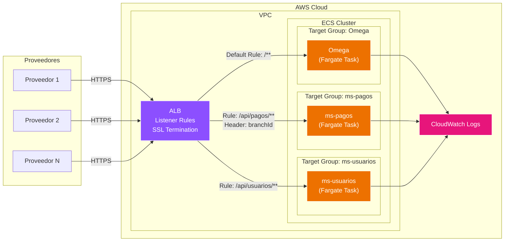

### Diagrama de Secuencia

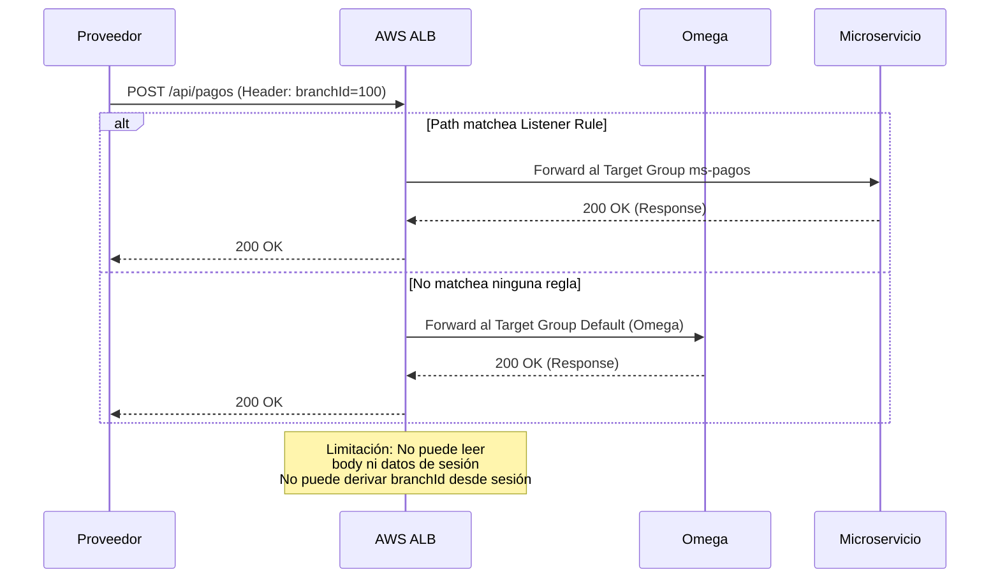

---

## Opción B: Spring Cloud Gateway (Fargate) — RECOMENDADA

### Diagrama de Arquitectura

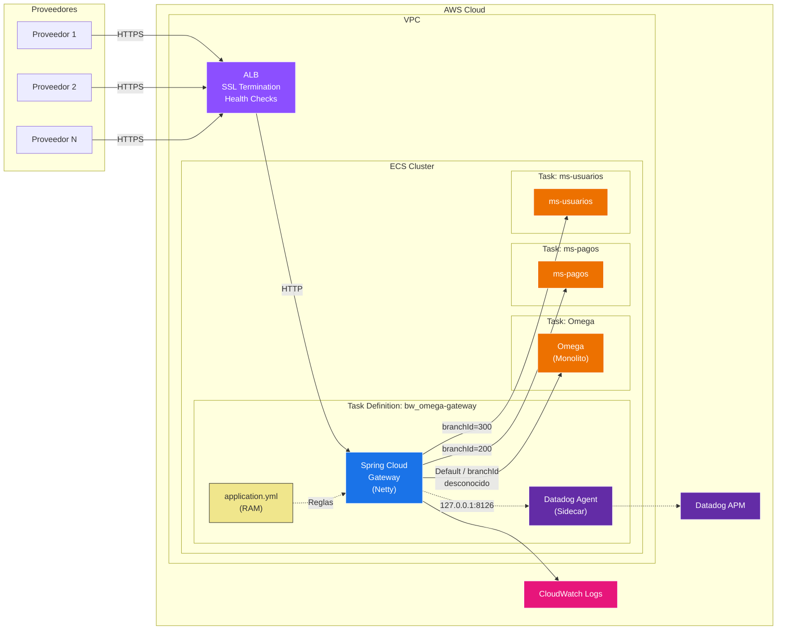

### Diagrama de Secuencia — Fase 1 (Pasamanos Transparente)

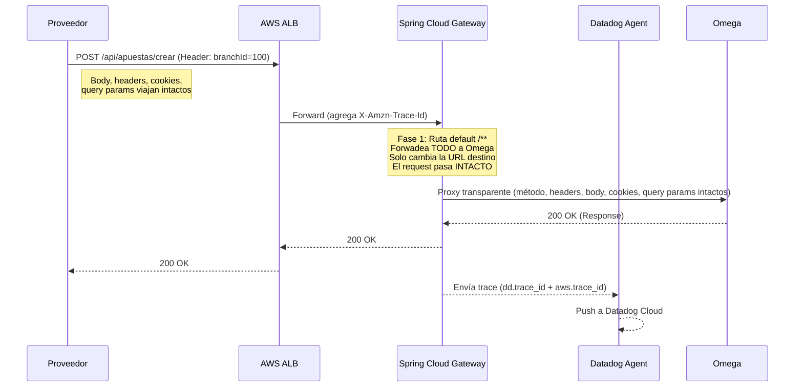

### Diagrama de Secuencia — Fase 2 (Ruteo por branchId en Header)

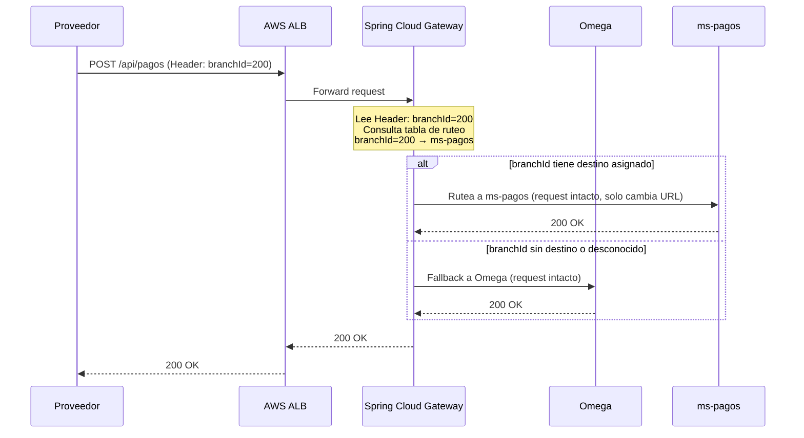

### Diagrama de Secuencia — Fase 3 (Resolución de branchId desde Sesión)

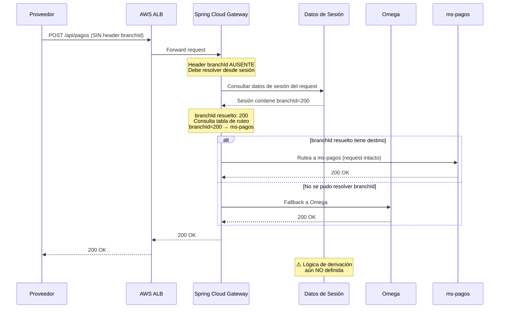

---

## Opción C: NGINX / OpenResty (Fargate)

### Diagrama de Arquitectura

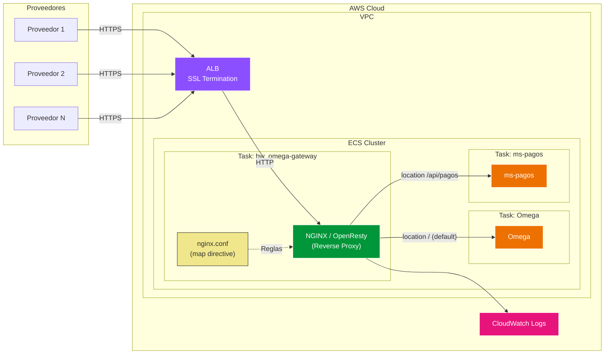

### Diagrama de Secuencia

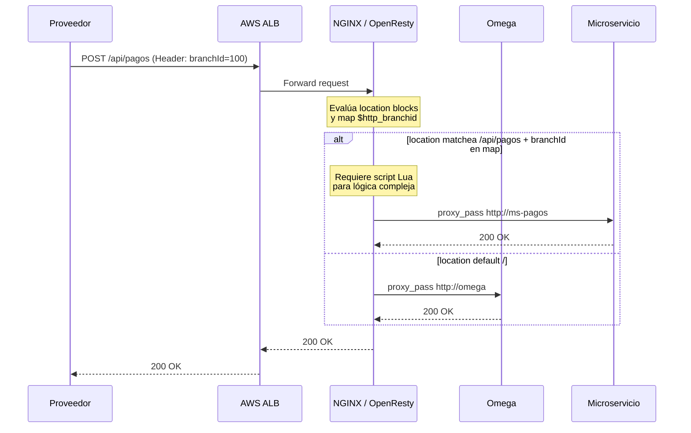

---

## Opción D: AWS API Gateway (Servicio Gestionado)

### Diagrama de Arquitectura

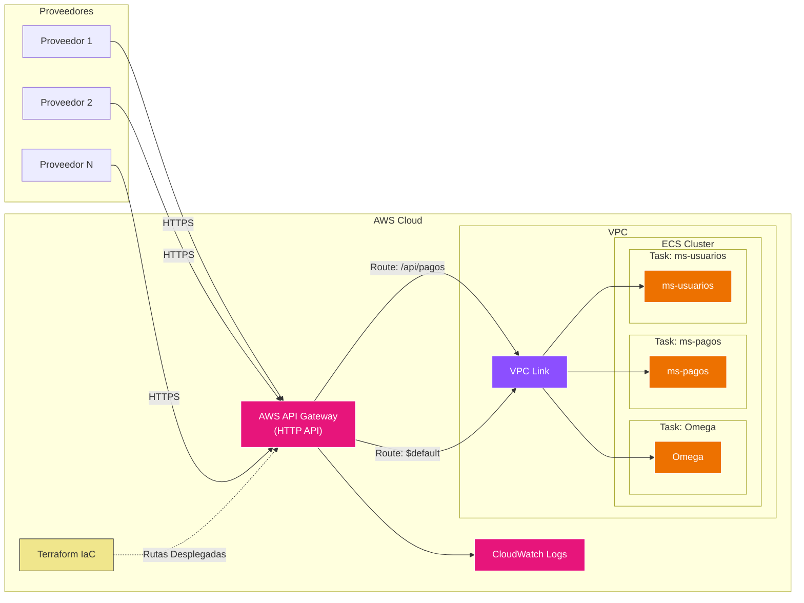

### Diagrama de Secuencia

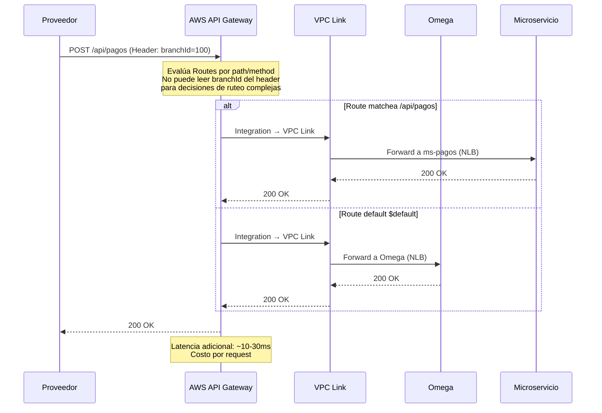

---

## Opción E: CloudFront + Lambda@Edge

### Diagrama de Arquitectura

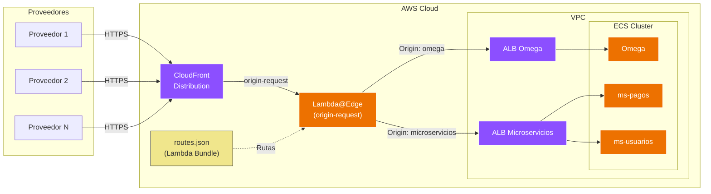

### Diagrama de Secuencia

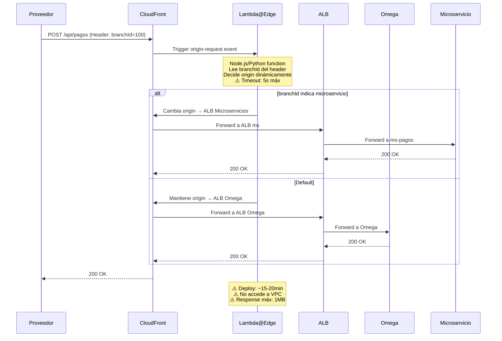

---

---

## Opción G: Custom Go API Gateway + Redis (Fargate) — 👑 ELEGIDA OFICIAL

### Diagrama de Arquitectura
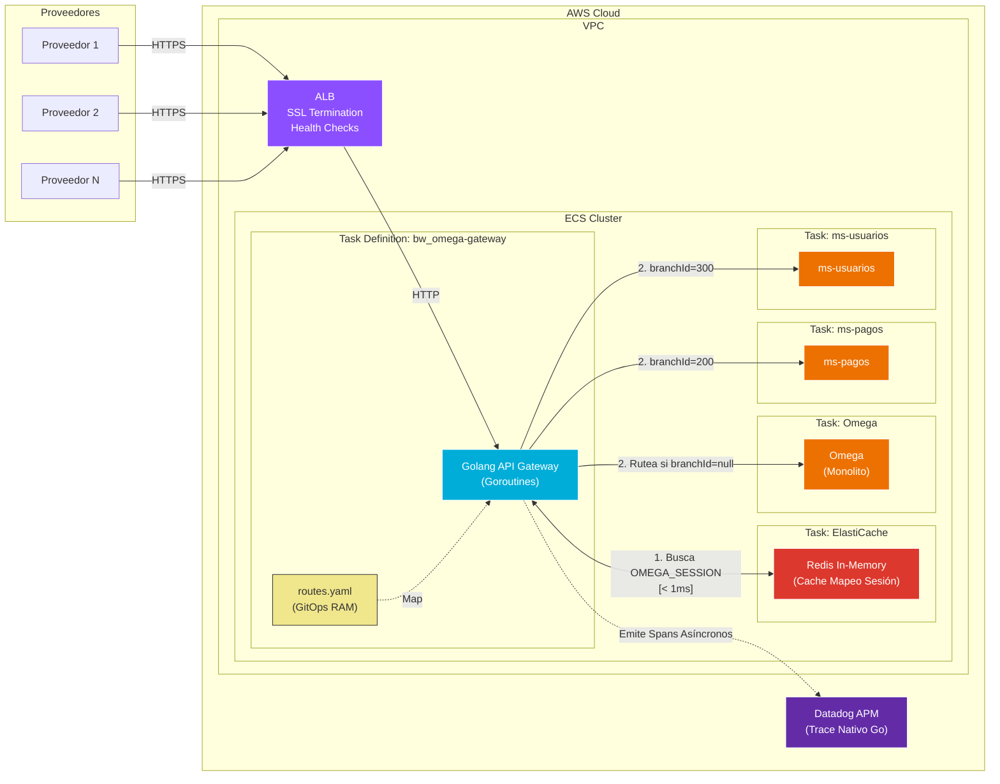

### Diagrama de Secuencia — Resolución de Sesión In-Memory (Redis)

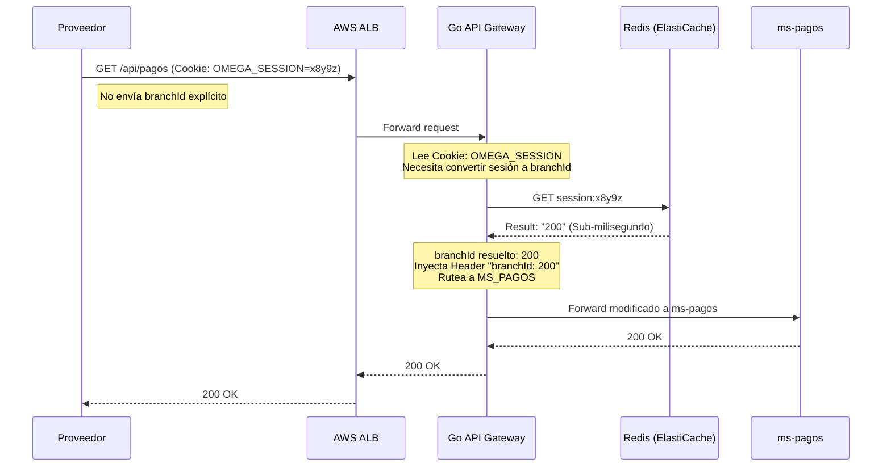

---

## Diagrama Comparativo Revisado — Flujo General Completo

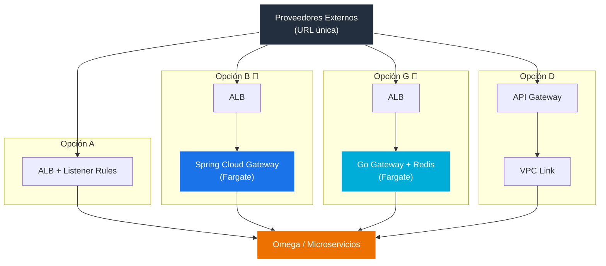

---

## Diagrama de Testing: Mocks

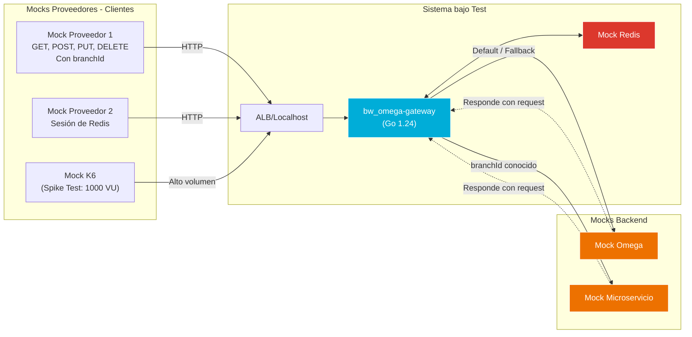

## 6. Supuestos y Consideraciones (Configuración de Red)

> [!NOTE]
> Durante la etapa iterativa de POC y armado funcional de las opciones, los destinos (`endpoints` de *Fallback* u otros microservicios) y las configuraciones de puertos **se han configurado en duro apuntando a `localhost` y puertos fijos (ej. `localhost:3000`)**.
> 
> **Action Item para Producción:** Esta configuración es **exclusivamente a modo de prueba local**. En la arquitectura de AWS productiva (donde el Go Gateway resida en AWS Fargate), las URLs de enrutamiento se deberán inyectar y declarar apropiadamente resolviendo por Service Discovery de Amazon ECS, `Cloud Map`, o balanceadores transaccionales internos (ALBs de Backend), evitando la dependencia de IPs / Localhosts estáticos en la declaración de las Opciones probadas.
