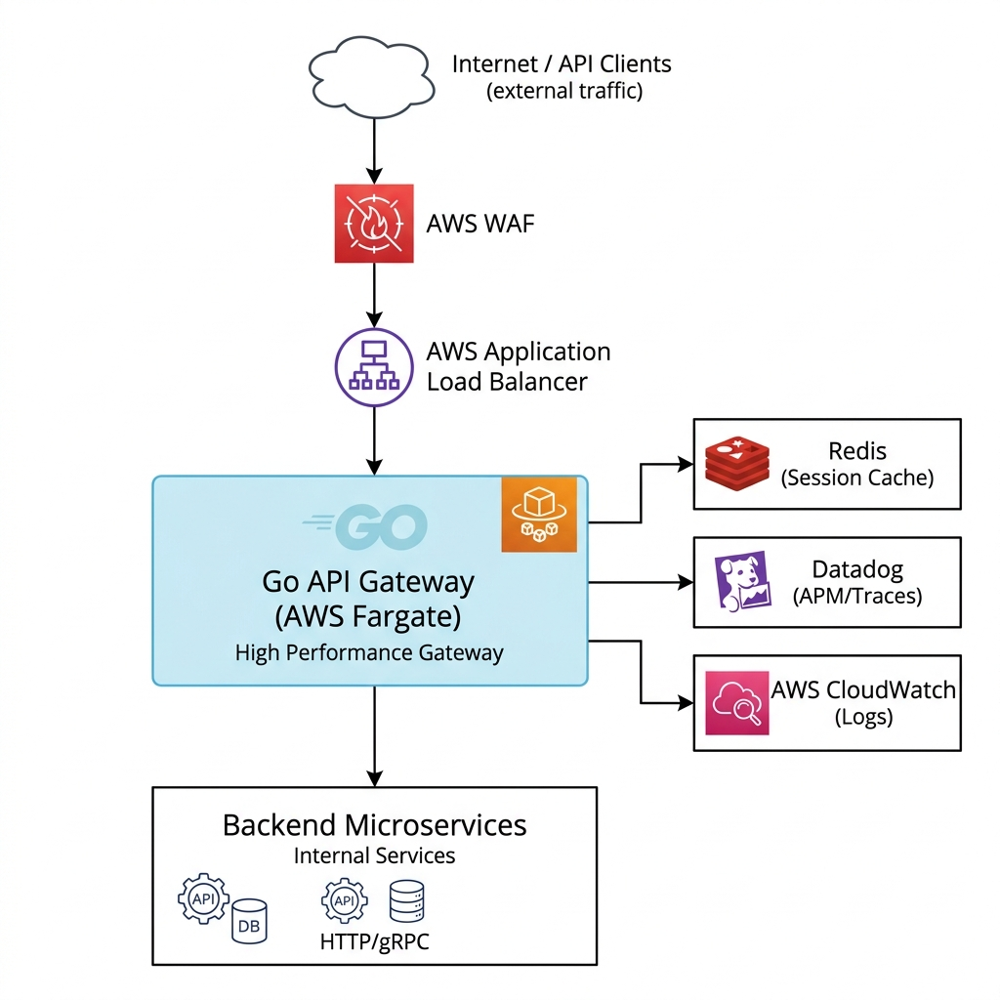
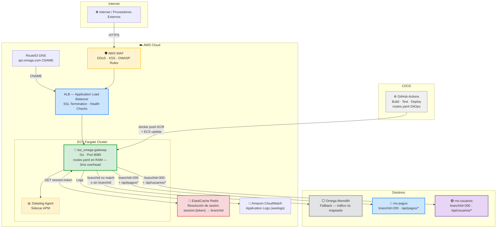

# Contexto y Arquitectura — bw_omega-gateway

## 1. El Problema

**Omega** es una plataforma de **juegos online (betting)** que opera como monolito. Sus servicios son consumidos por múltiples proveedores externos a través de una **URL única**. La migración progresiva hacia microservicios implica nuevas URLs internas, sin que los proveedores deban cambiar sus integraciones.

> ⚠️ **ADVERTENCIA:**
> Omega recibe **alto volumen de tráfico** en condiciones normales, multiplicado durante eventos deportivos de alto perfil (Mundial, Champions, Super Bowl). El gateway debe soportar estos picos sin degradar latencia.

## 2. La Solución

Interponer el **bw_omega-gateway** como componente proxy/gateway que:

1. **Fase 1 — Pasamanos 100% transparente:** Recibe todo el tráfico y lo reenvía a Omega sin ninguna modificación (headers, body, query params, cookies, método HTTP viajan intactos).
2. **Fase 2 — Ruteo por `branchId`:** Identifica al proveedor por el header `branchId` y lo dirige al microservicio correspondiente o hace fallback a Omega.
3. **Fase 3 — Resolución de sesión:** Si `branchId` no viene en el header, lo deduce del token de sesión `OMEGA_SESSION` vía Redis.

### Principio Fundamental: Pasamanos Transparente

> ❗ **IMPORTANTE:**
> El gateway **NO modifica la invocación** en ningún aspecto excepto la URL de destino. Todo el contenido del request original (método HTTP, headers, body, query params, cookies) llega **intacto** al destino.

## 3. Arquitectura Elegida

### Diagrama Visual



### Diagrama Técnico (Mermaid)



## 4. Lógica de Resolución de branchId

```
Request entrante
  │
  ├─ ¿Header branchId presente? ──YES──► Usarlo directamente
  │
  └─ NO ──► Leer cookie OMEGA_SESSION
                │
                └─ Consultar Redis: GET session:{cookie}
                       │
                       ├─ Encontrado ──► Usar branchId de caché
                       └─ No encontrado ──► Fallback a Omega
```

## 5. Por qué Go

| Criterio | Go (Elegido) | Spring Boot (B) | NGINX (C) |
|---|---|---|---|
| Latencia P99 | **< 1ms** | ~12ms | ~2ms |
| RAM en idle | **~20MB** | ~400MB | ~30MB |
| Cold start | **< 5ms** | ~15-30s | ~1s |
| Lógica condicional | ✅ Total | ✅ Total | ⚠️ Solo con Lua |
| Redis integration | ✅ Nativa | ✅ Nativa | ❌ Difícil |
| Datadog APM | ✅ `dd-trace-go` | ✅ Java Agent | ⚠️ Módulo separado |
| Costo Fargate | **Mínimo** | 6x más RAM | Bajo |
