# Diagramas de Arquitectura — bw_omega-gateway

> **Contexto:** bw_omega-gateway es el proxy/gateway que se interpone entre los proveedores externos y **Omega** (plataforma de juegos online). Omega recibe alto tráfico, especialmente durante eventos deportivos (Mundial, Champions, etc.).

Cada opción se presenta con un diagrama de arquitectura y un diagrama de secuencia que muestra el flujo de una petición típica.

---

## Opción A: AWS ALB + Listener Rules (Solo Infra)

### Diagrama de Arquitectura

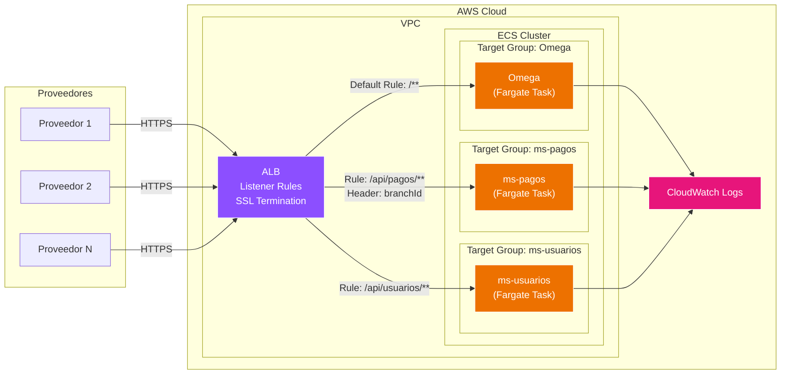

### Diagrama de Secuencia

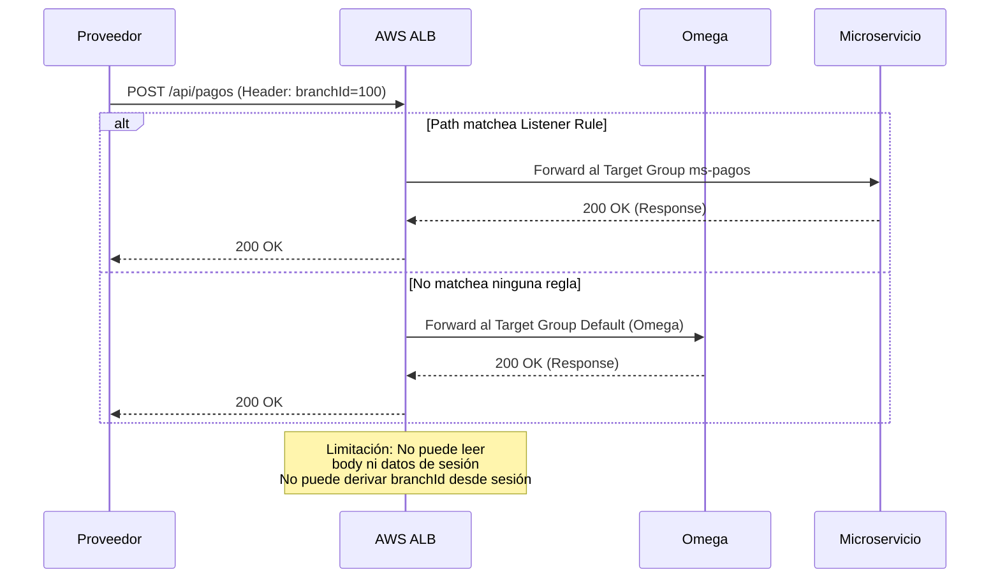

---

## Opción B: Spring Cloud Gateway (Fargate) — RECOMENDADA

### Diagrama de Arquitectura

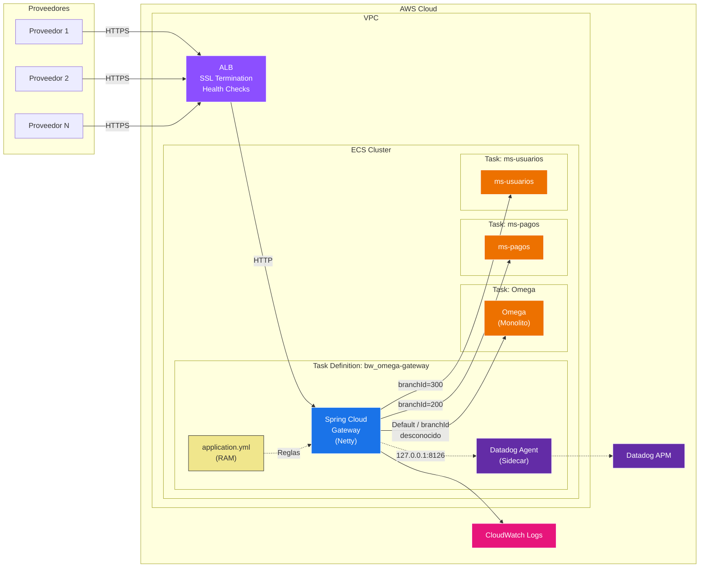

### Diagrama de Secuencia — Fase 1 (Pasamanos Transparente)

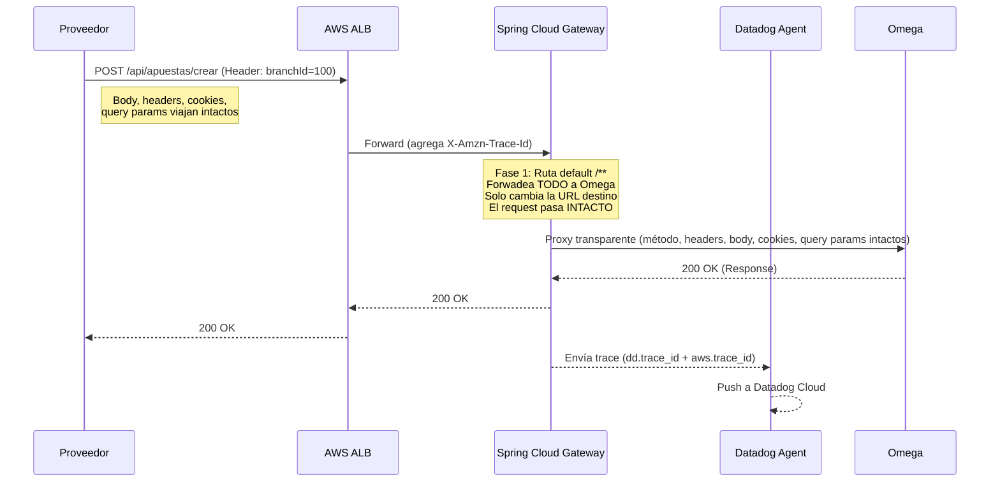

### Diagrama de Secuencia — Fase 2 (Ruteo por branchId en Header)

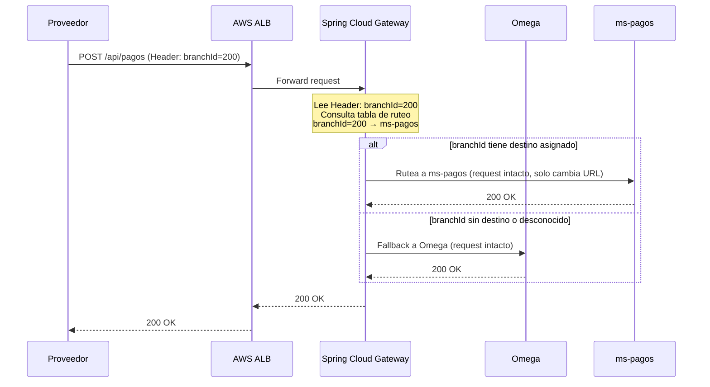

### Diagrama de Secuencia — Fase 3 (Resolución de branchId desde Sesión)

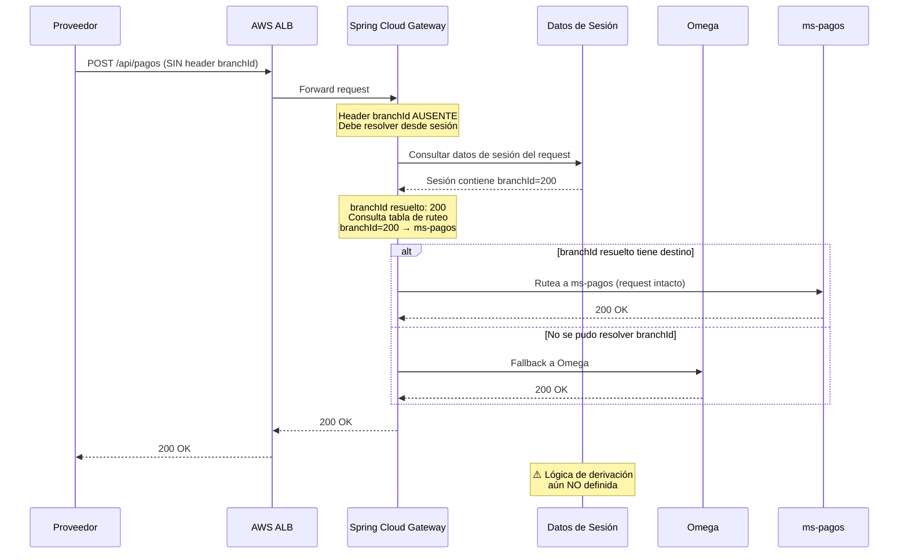

---

## Opción C: NGINX / OpenResty (Fargate)

### Diagrama de Arquitectura

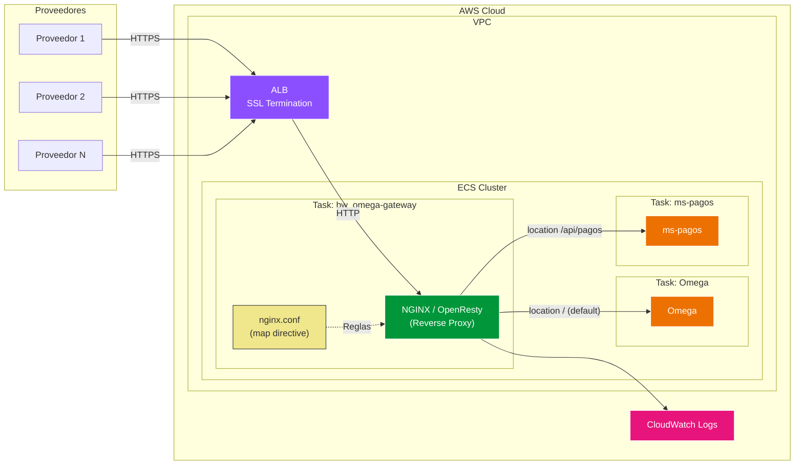

### Diagrama de Secuencia

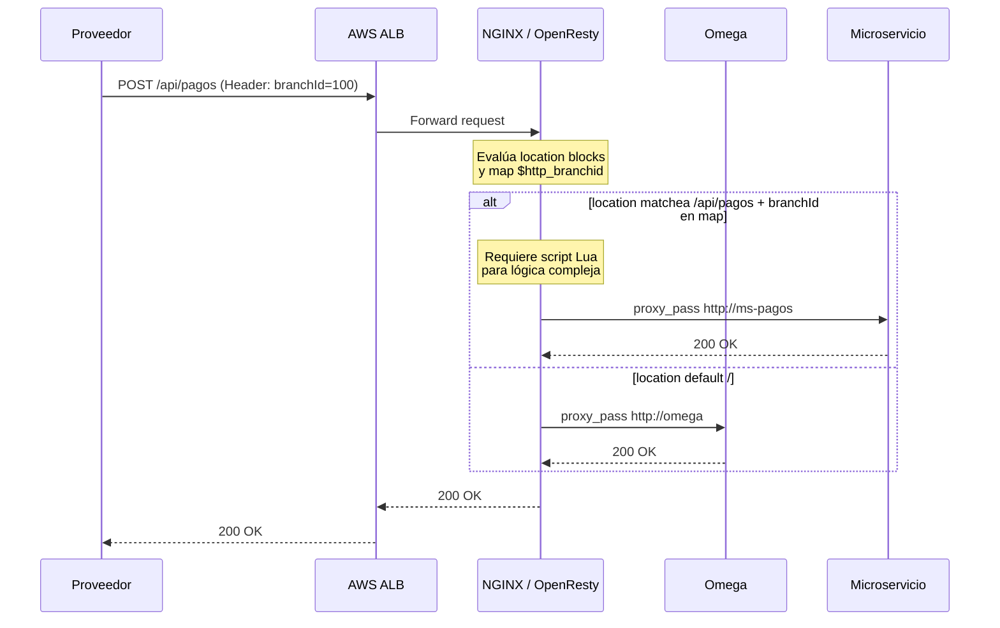

---

## Opción D: AWS API Gateway (Servicio Gestionado)

### Diagrama de Arquitectura

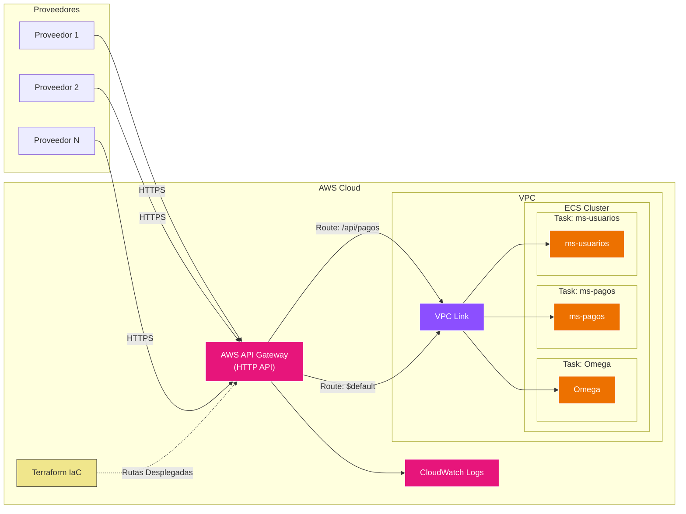

### Diagrama de Secuencia

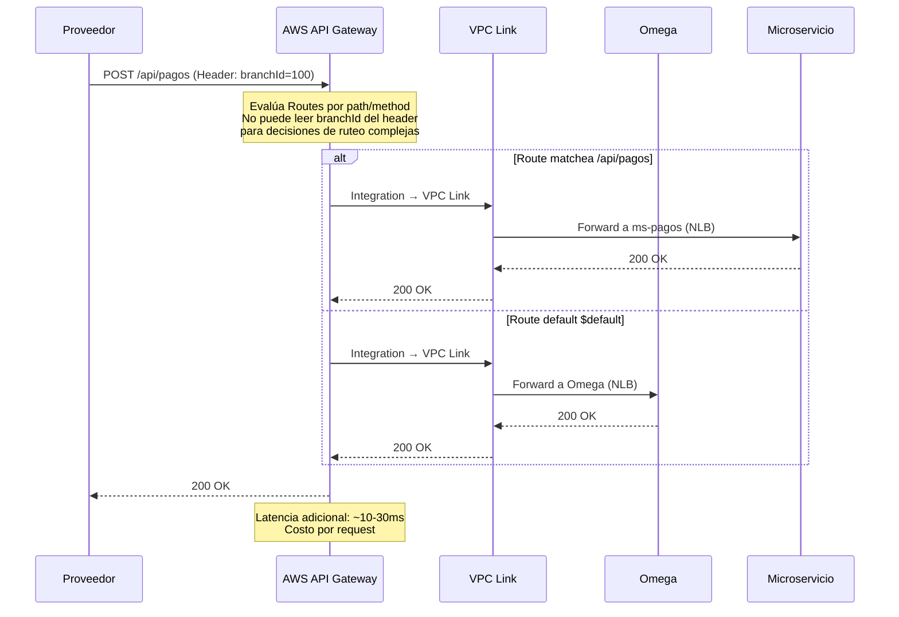

---

## Opción E: CloudFront + Lambda@Edge

### Diagrama de Arquitectura

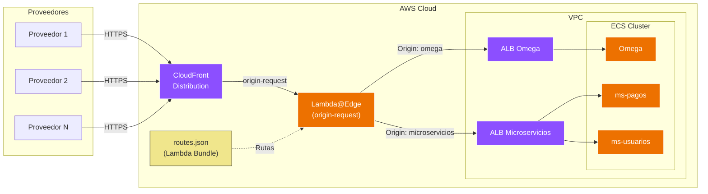

### Diagrama de Secuencia

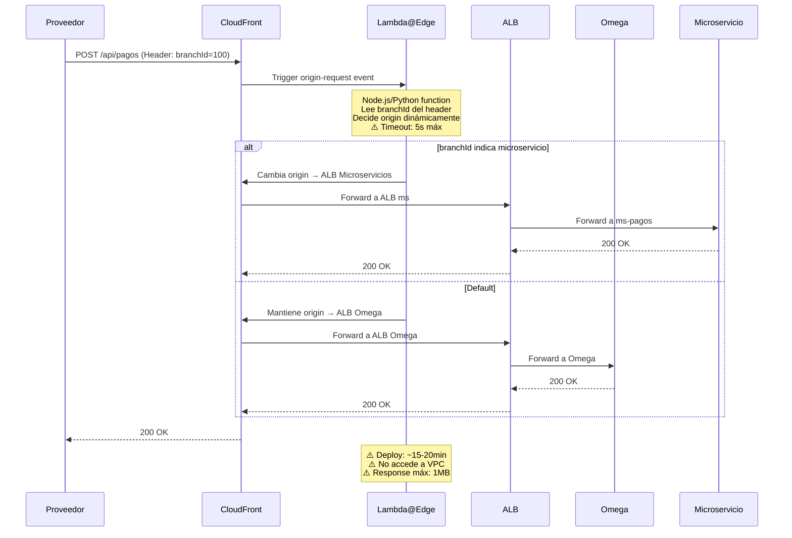

---

---

## Opción G: Custom Go API Gateway + Redis (Fargate) — 👑 ELEGIDA OFICIAL

### Diagrama de Arquitectura
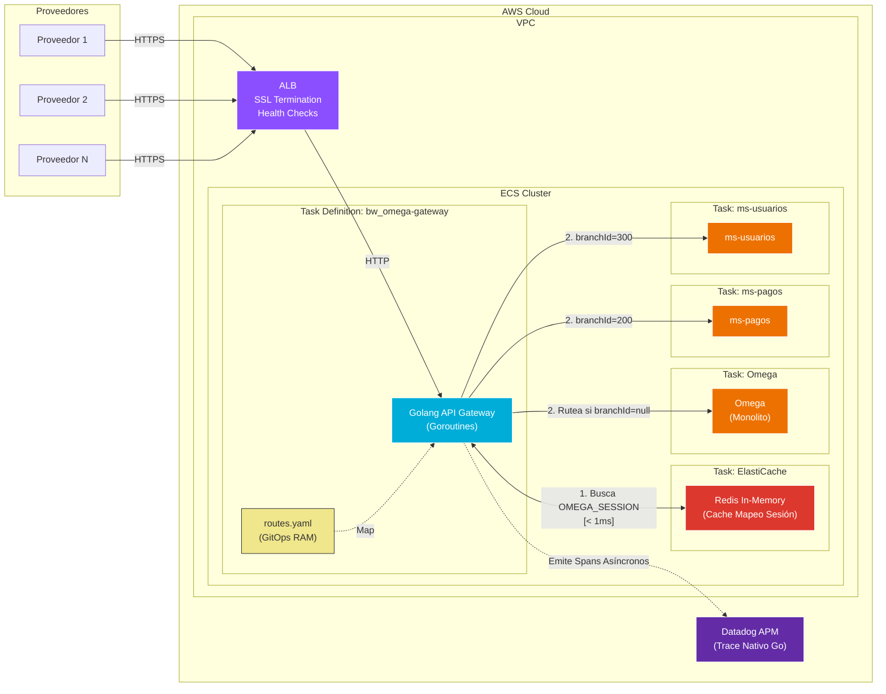

### Diagrama de Secuencia — Resolución de Sesión In-Memory (Redis)

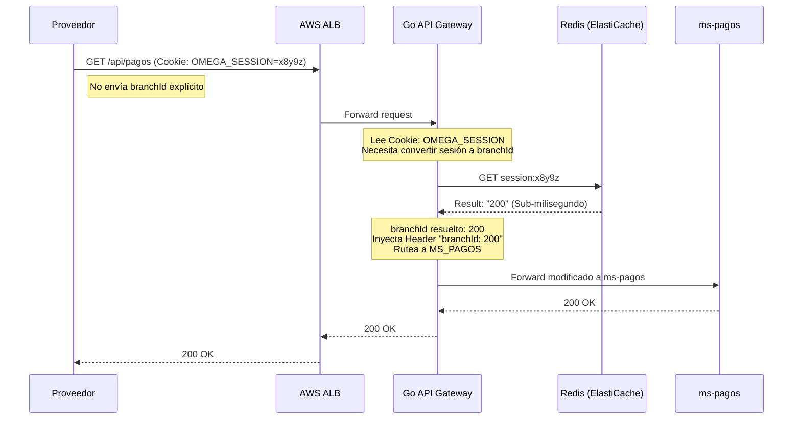

---

## Diagrama Comparativo Revisado — Flujo General Completo

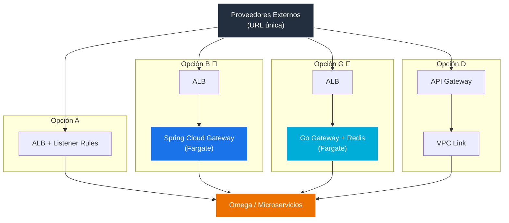

---

## Diagrama de Testing: Mocks

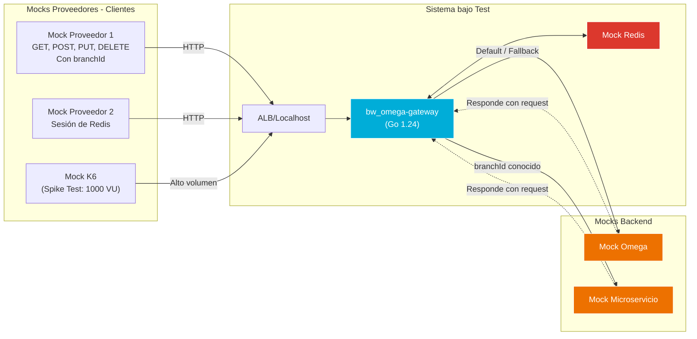
